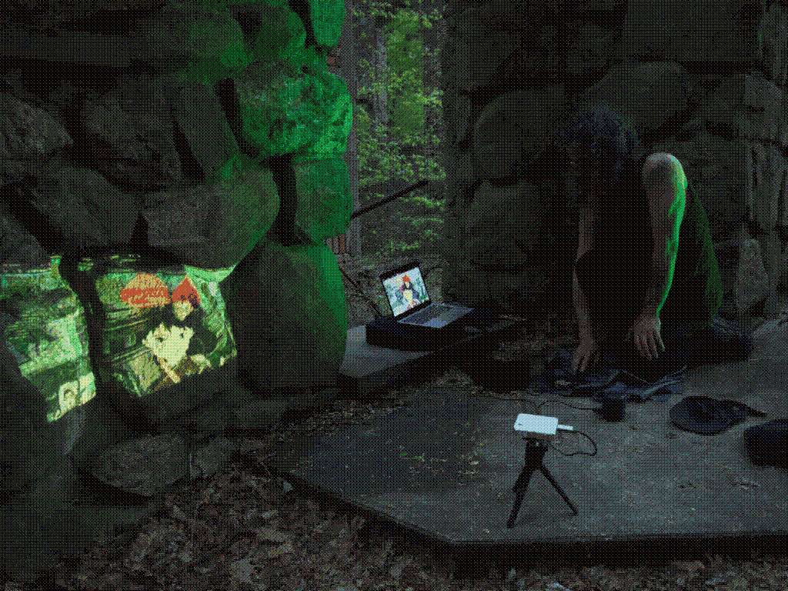
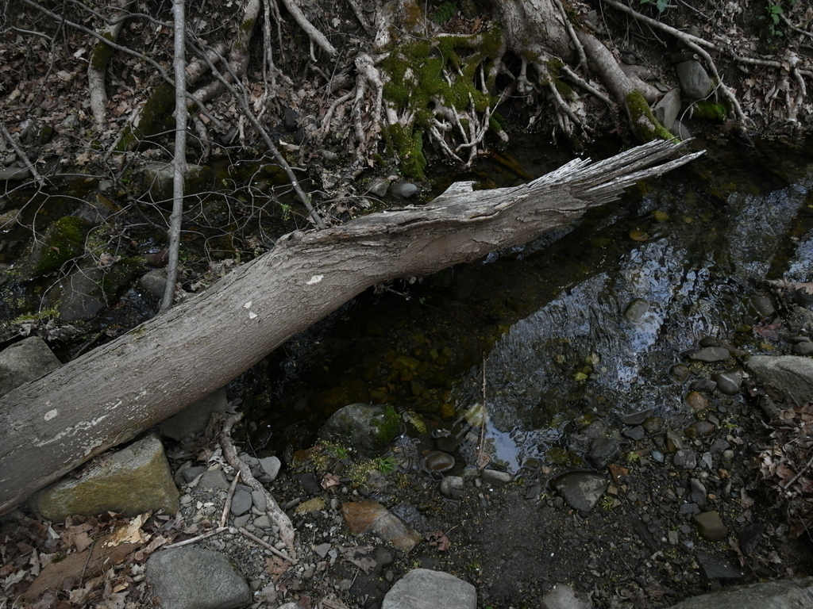
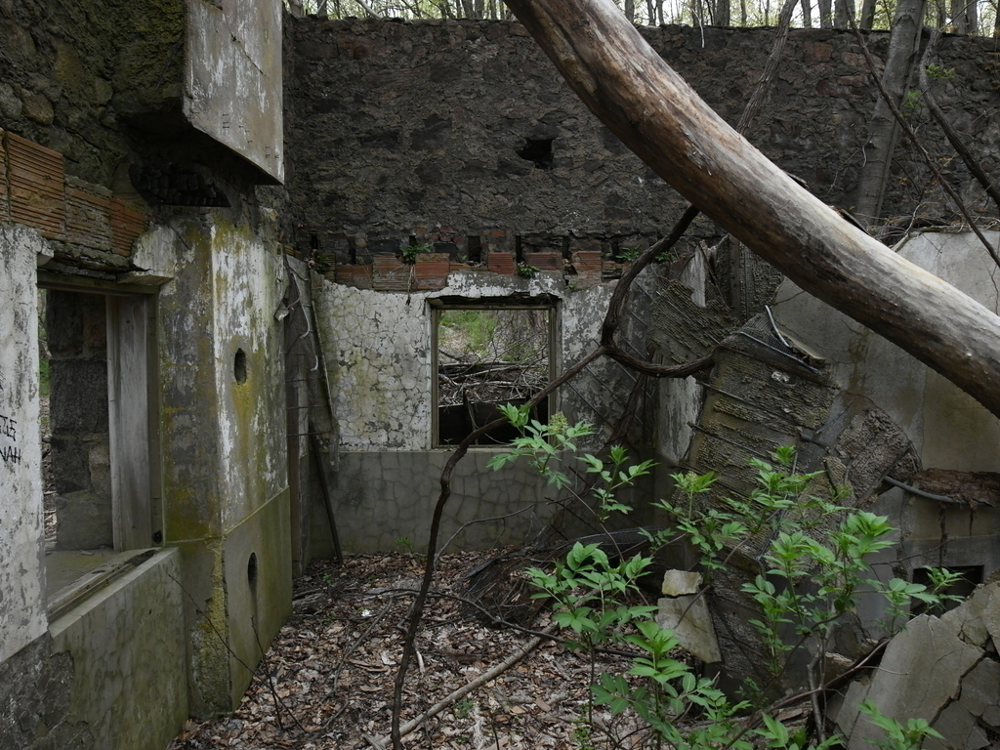
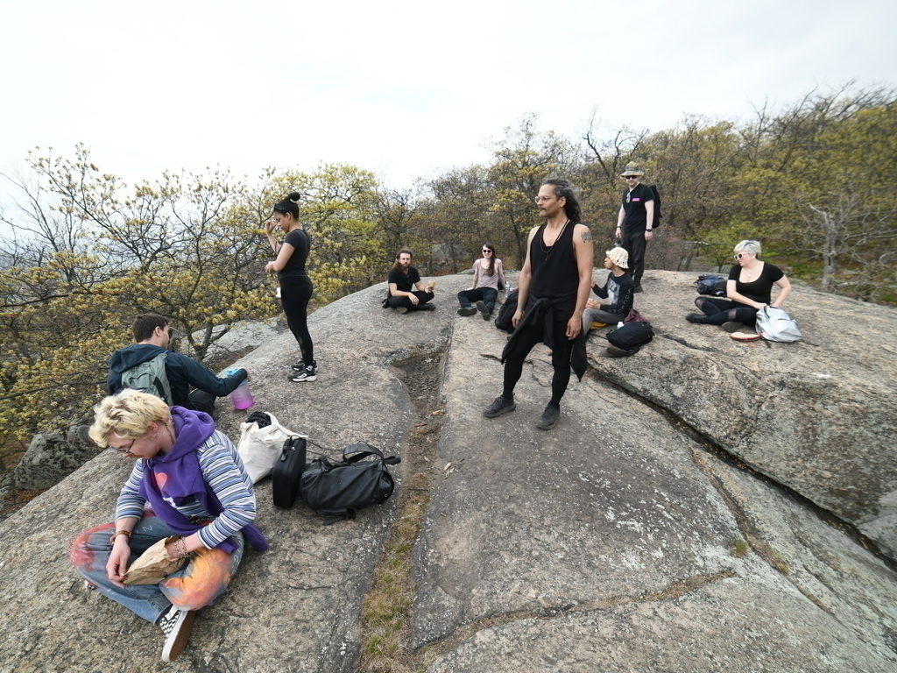
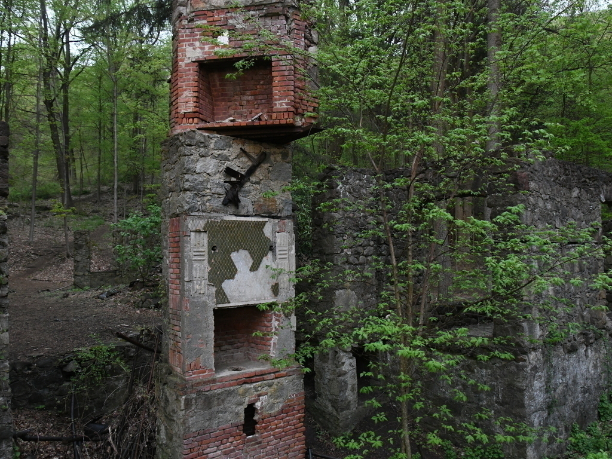
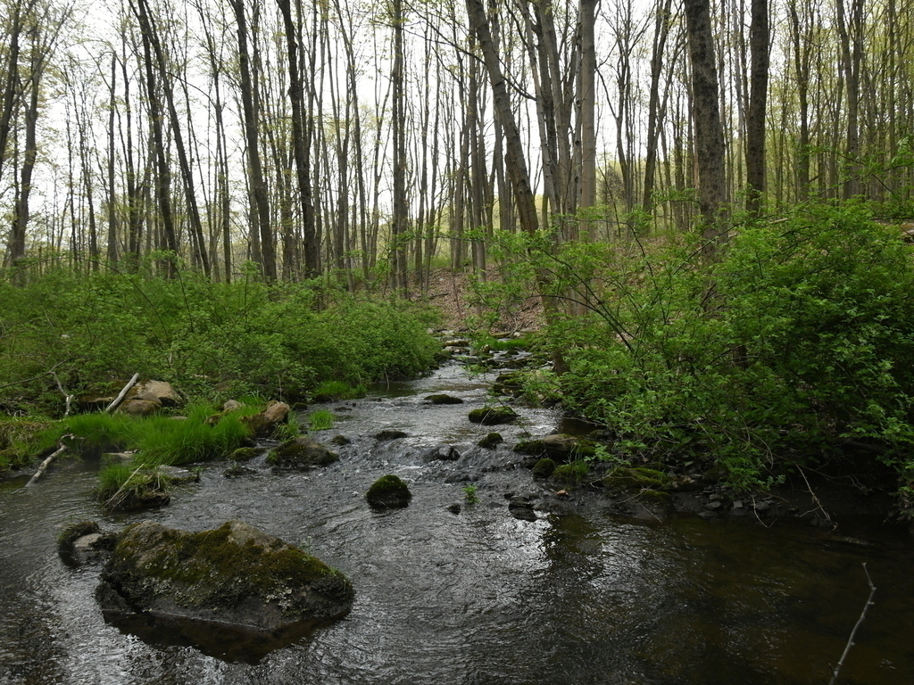
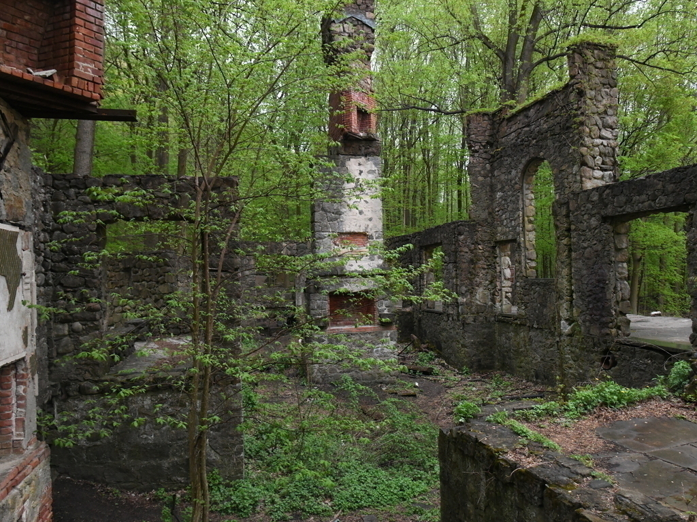
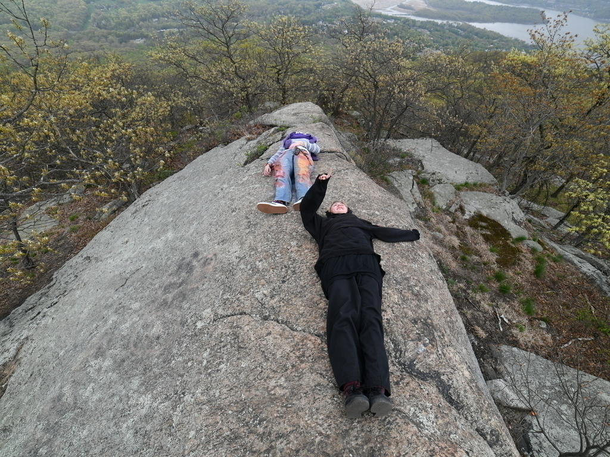
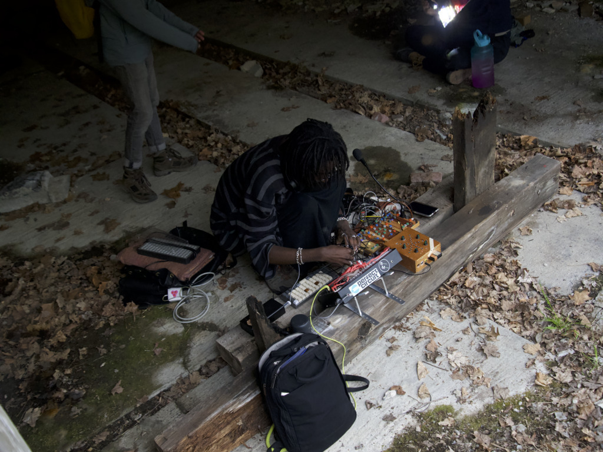

<body background="w.gif">

<section>

<code>SAT 22 April 2023; Cold Spring, NY; Bull Hill</code> 
<code>A celebration for our Mother Earth, in the form of a low-impact walk, and performance.</code> 
<code>2 miles from the Cold Spring Hudson Line station, near the Cornish Estate Ruins.</code> 
<code>Live coding spells will take place in the woods.</code> 

<code>Special thanks to Mark Denardo for organizing a beautiful event</code> 

<marquee>
#what unit of measurement is used to measure water vapor
</marquee>

<audio controls autoplay style="visibility: hidden">
  <source src="bgm.mp3" type="audio/mpeg">
</audio>

 

 
 

</section>

<link href="https://melonking.net/styles/flood.css" rel="stylesheet" type="text/css" media="all" />

