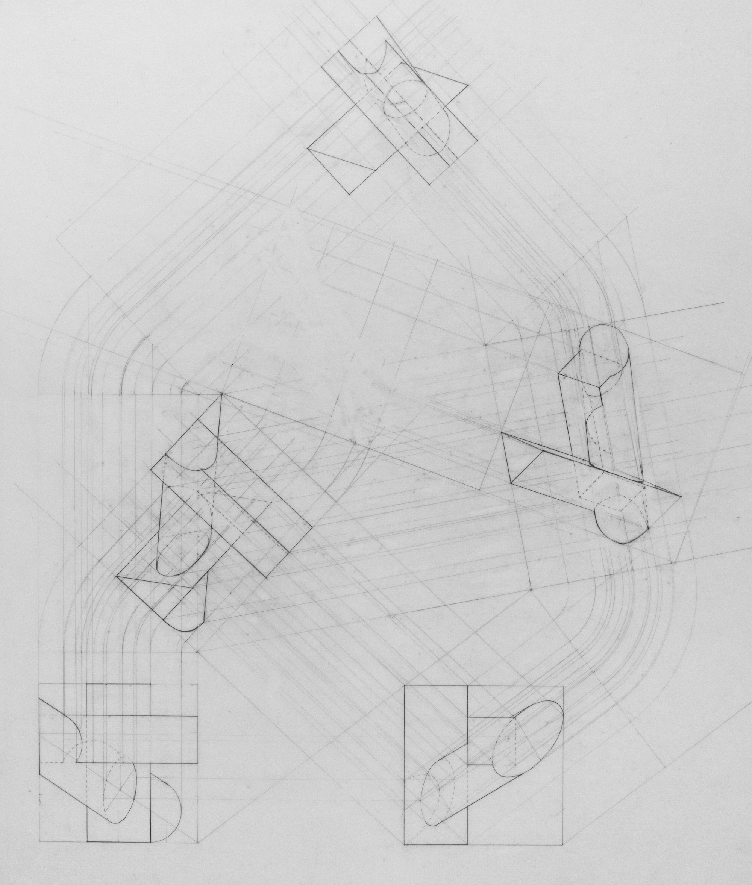

<head>
    <meta charset="UTF-8">
    <meta name="viewport" content="width=device-width, initial-scale=1.0">
    <title>Blur Image on Hover</title>
    
</head>

[ARCH21-ST-07](ARCH21-ST-07.html) STATES OF EXCEPTION 

[ARCH12-ST-03](ARCH12-ST-03.html) SPACES FOR MEDIATION

