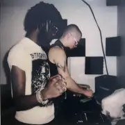
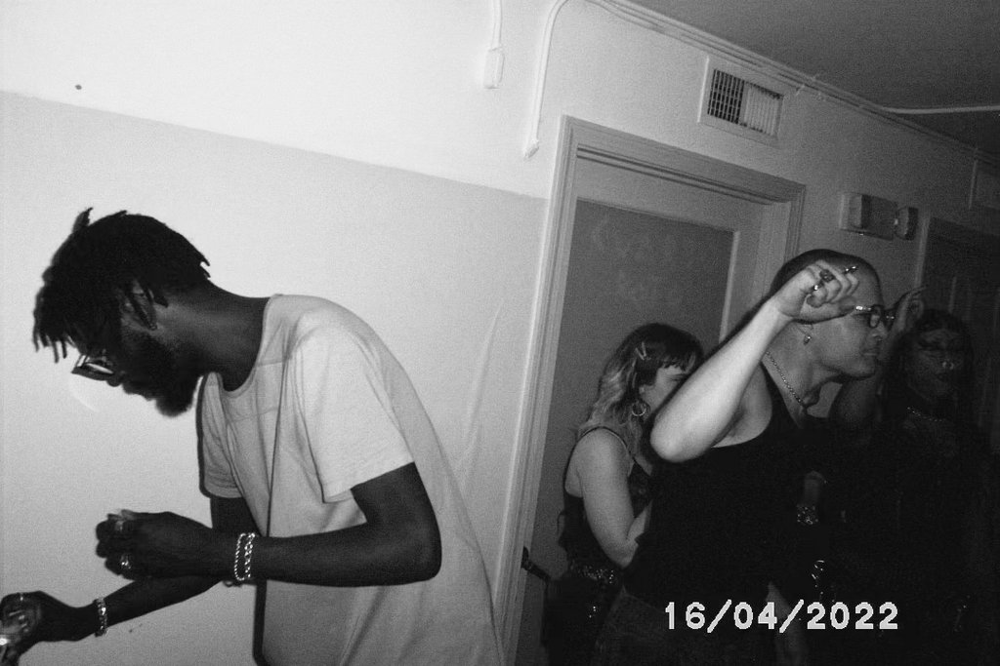

<body background="musik028.gif">

<table border="20" background="sexi2.gif" cellpadding="5px">
<tr>
<th>

<table border="2" background="sexi2.gif" bordercolor="pink">
<tr>
<th>
<mark>
DJ and Live Experimental Techno and Electronic based duo, Femi Shonuga and Hank Hurst.
SAVR started off as a B2B throwing underground techno parties in Providence RI with a night named Hidden. The night was soon picked up by local techno event promoter Symposium Records which held dance and techno events at a venue named 1911. Resident DJs Femi Shonuga and Hank Hurst provide breakbeat, mininimal, abstract, hypnotic, and groovy techno to the underground techno scene in the New England/NYC Area and hope to bring their night on tour as the underground techno scene grows.
</mark>
</th>
</tr>
</table>

<marquee scrollamount="5" behavior="alternate">

</marquee>
</th>
</tr>
</table>

<table border="40" background="sexi3.gif">
<tr>
<th>

</th>
</tr>
</table>

