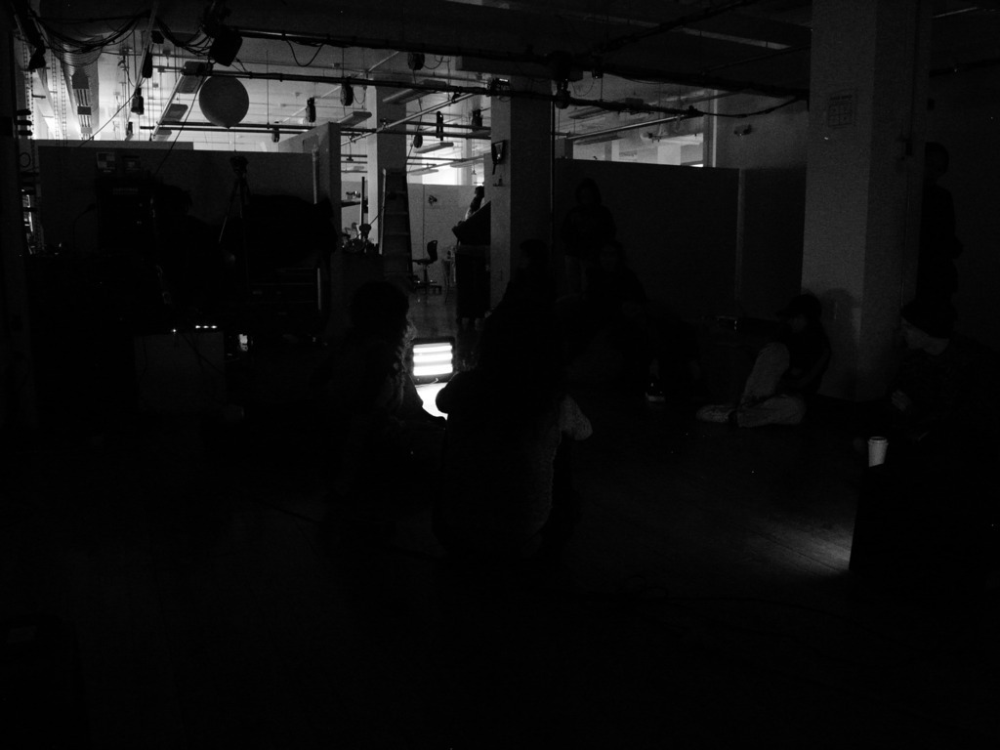
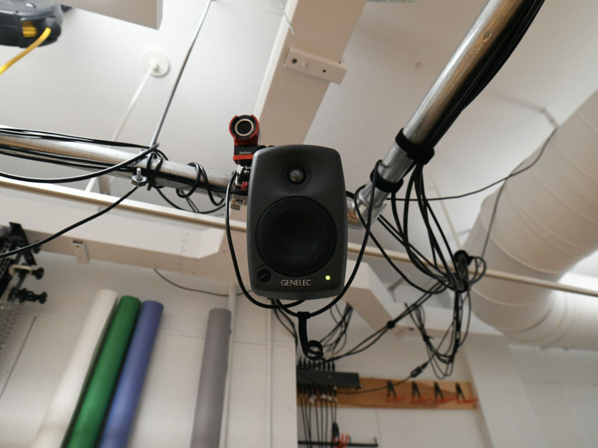
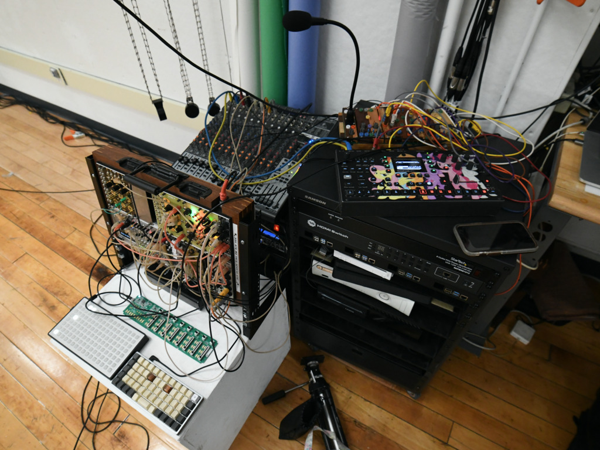

[Watch](https://www.youtube.com/watch?v=8mXzCg3dbEI) the performance 

[Listen](https://sadnoise.bandcamp.com/album/according-to-chance) to the performance 

All sound sources used in this work are comprised of simple waveforms and white noise. This piece was preformed on February 8th In the Digital Media building at RISD. The piece was performed in 2nd order ambisonics on an 8 channel Genelec speaker array using Reaper, IEM plugins and a Korg Nanocontrol. All recordings of this piece are binaural for stereo listening. Monome Teletype provided all binary pattern and rhythm generation, and Grid was used as an interface for controlling various teletype operators. 

<marquee direction="up">
    

        <table border="20" align="center" width="758px">
            <tr>
                <th>
                    <embed src="atcfp.pdf" width="500px" height="400px" zoom="50">
                </th>
            </tr>
        </table>
    

</marquee>
