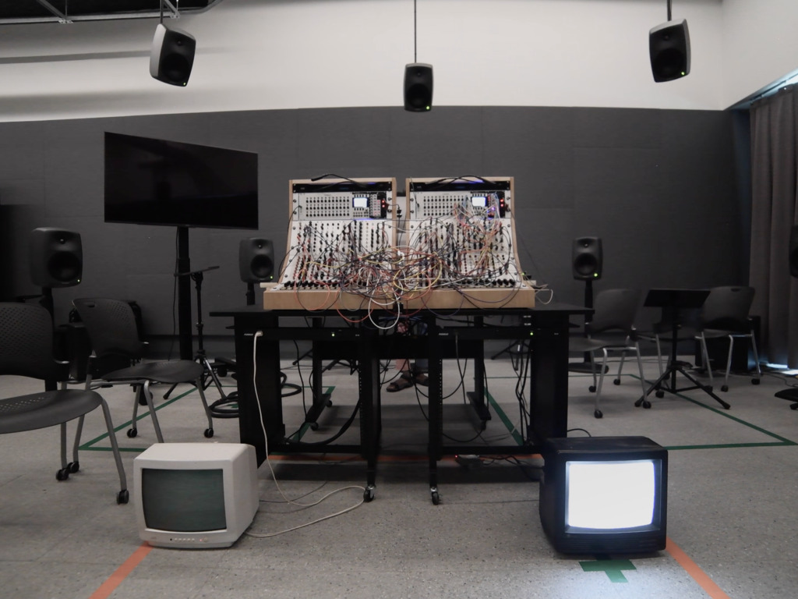

[Performance](https://www.youtube.com/watch?v=tYe3fY6j1IM) for Sound Synthesis Spring Semester

I have been really interested in creating immersive and complex textures with the Serge and I wanted to focus more on this idea of maximality by using feedback paths and cross modulation of signals (feeding back and wave multiplier or cross patching oscillators using their frequency modulation input) instead of a random source such as noise or sample and hold to have more control over the patch overall. This effectively let all of the individual sounds or characters communicate in an easier and more efficient way, allowing for a balance of chaos and each sound's primary source. I also wanted to focus on giving every individual sound its own space, so as to not have the patch be so dense.For my final project I wanted to focus on the idea of characters and synthesizing organic and controlled random. I used two CRT TVs as a visual representation of these characters, one visualizes the Serge analog synthesizer, and the other visualizes SuperCollider, to show the communication between analog and digital. I performed this patch live because I felt it was important to interact with these characters in real time, or in an improvisational way.

