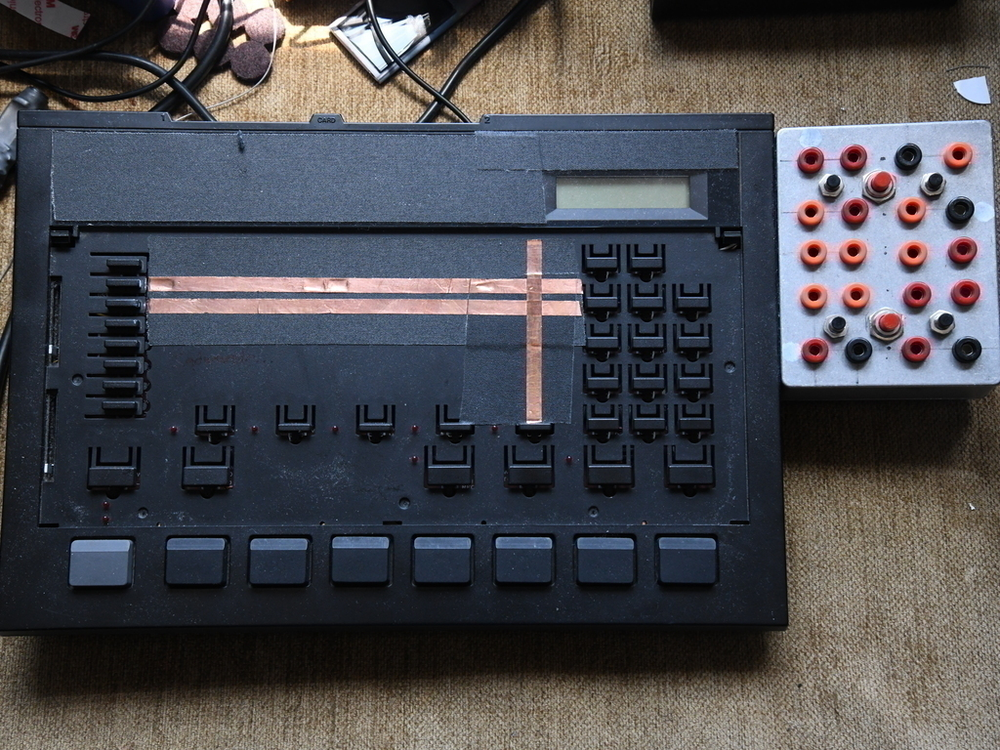
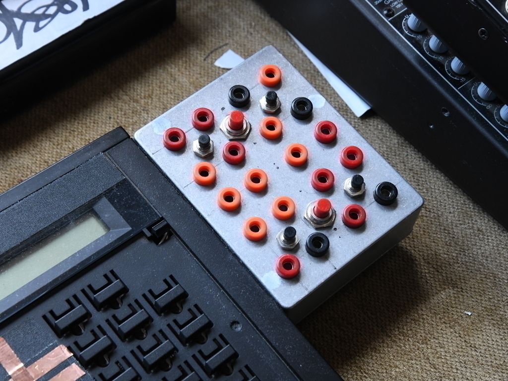
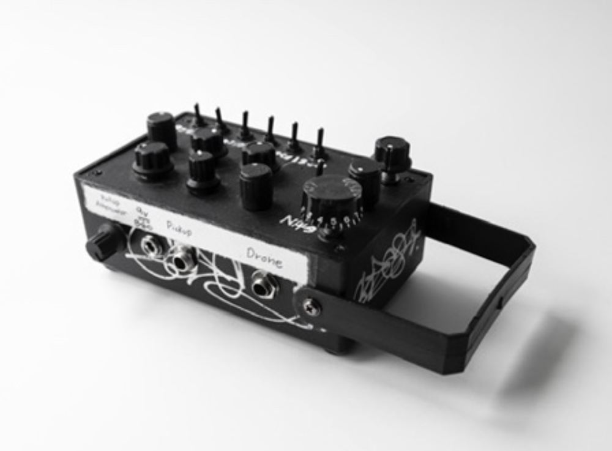
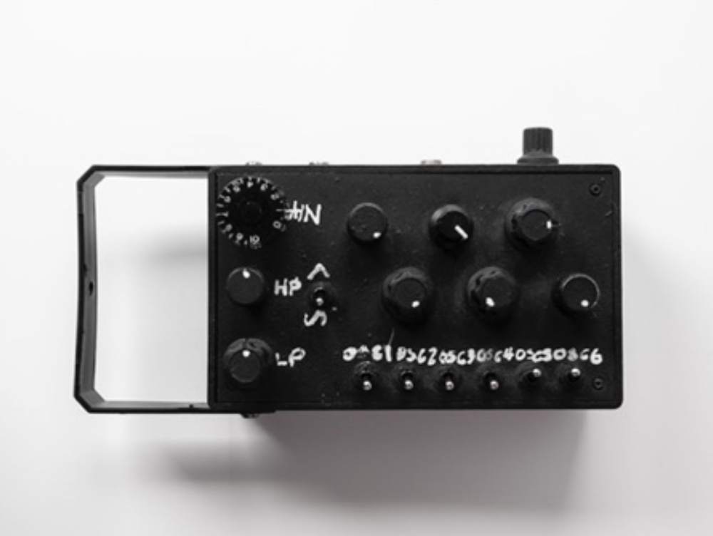
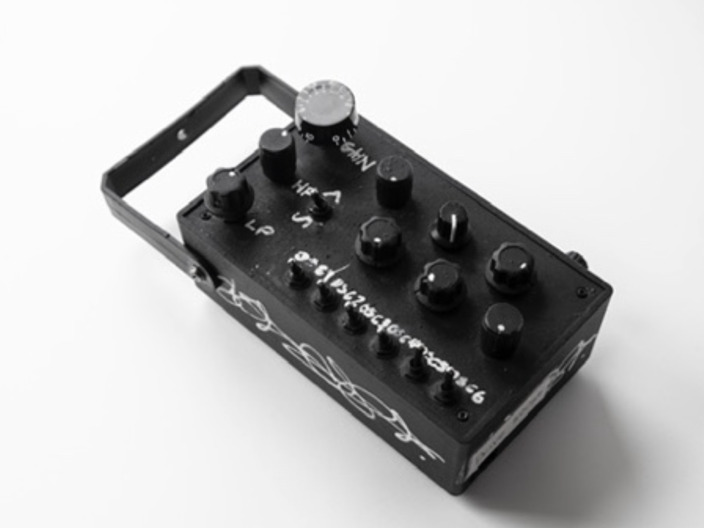
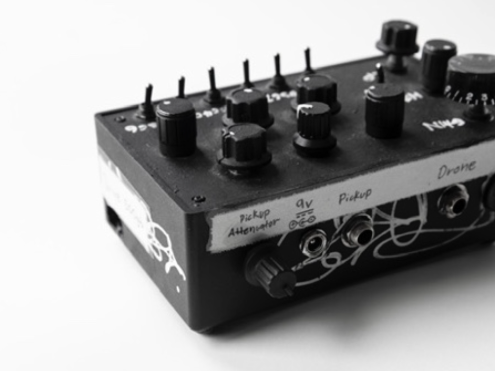
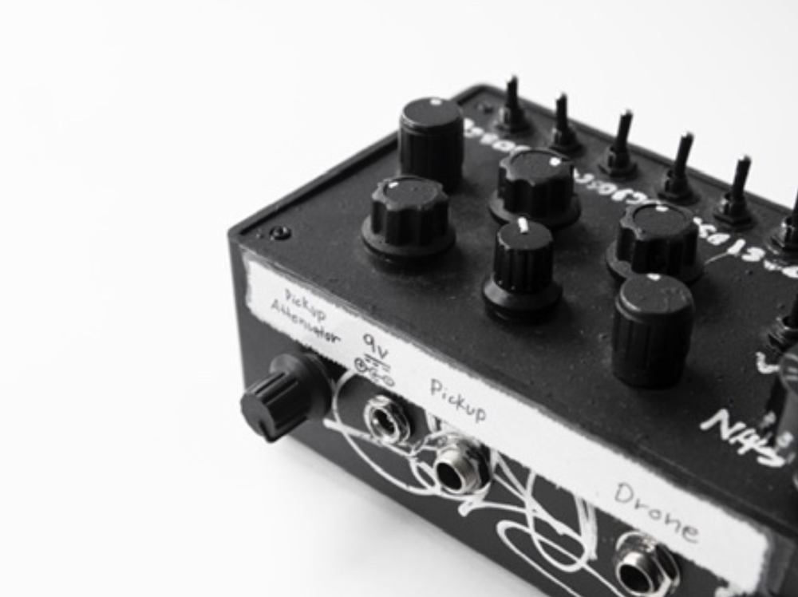

<body background="wiard.png" style="background-attachment: fixed;">
<article>
<h1>
Circuit Bent Projects
</h1>
Circuit Bent Korg-DDD5
 
 
    
  
    
  
    

 
<h1>
Circuit Bent King Drone Box
</h1>
<table border=40 background="tubes.png">
<tr><th>
 

 
 

 
 

 
 
</th></tr>
</th></tr>
</table>
</article>
