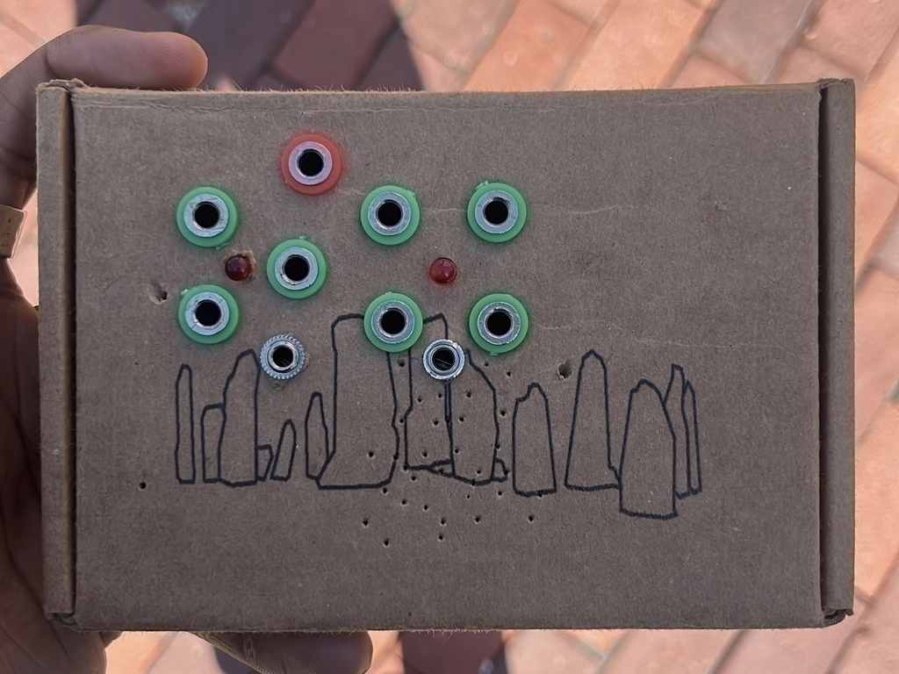
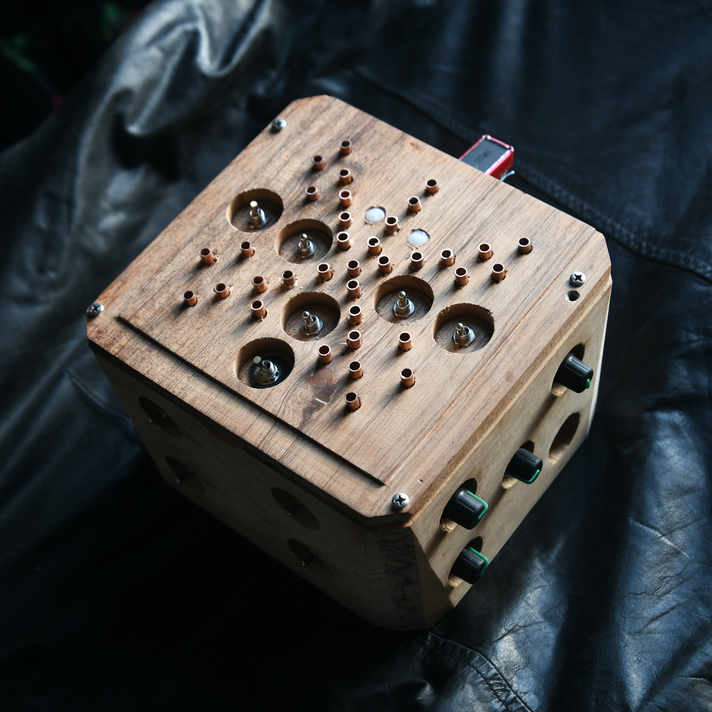
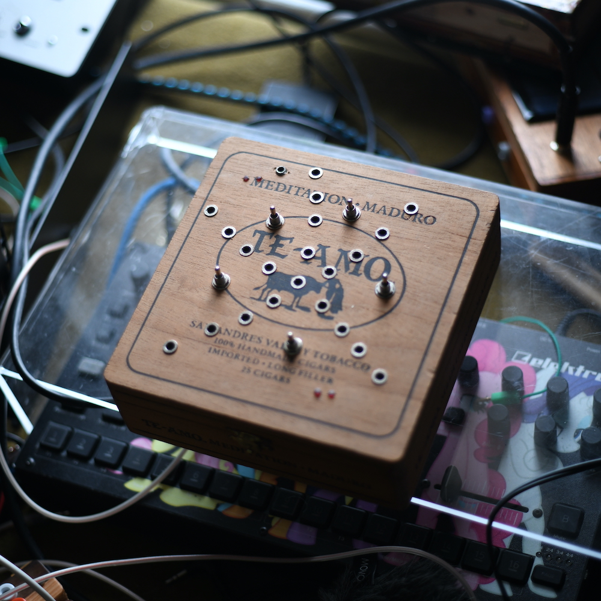
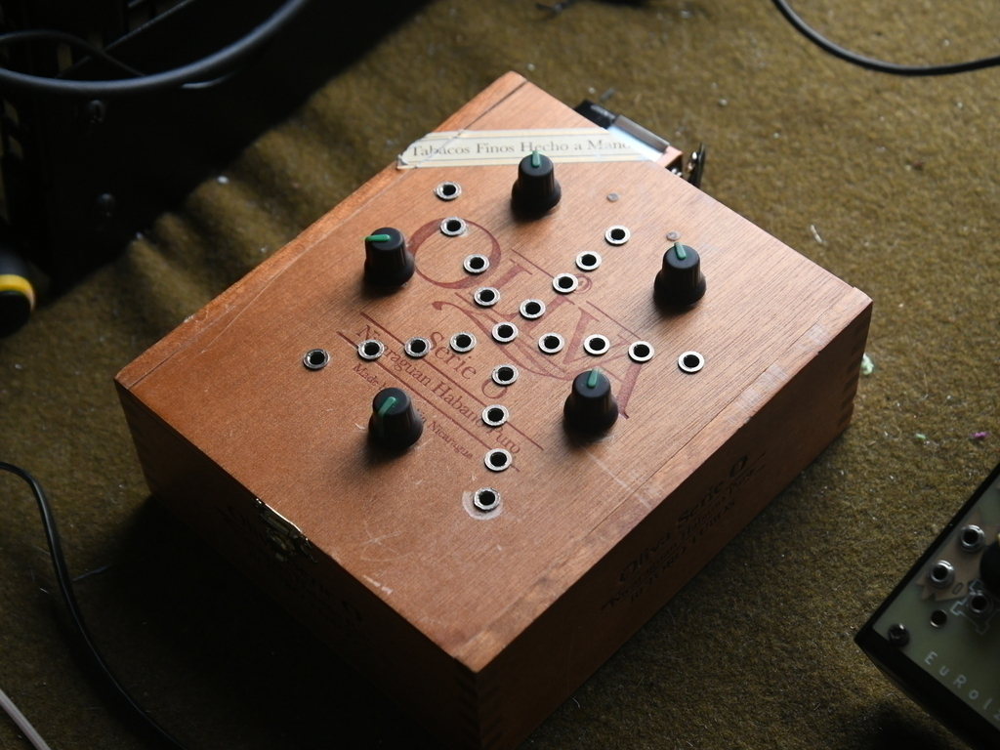
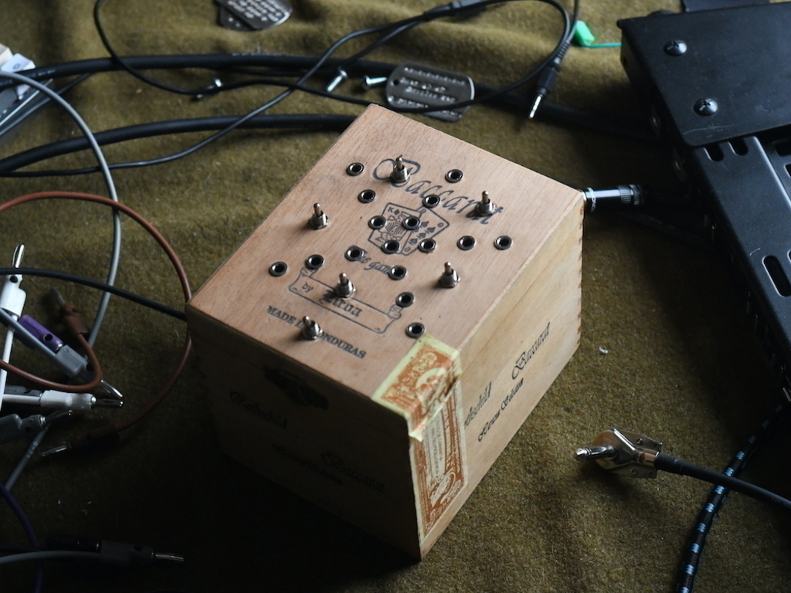
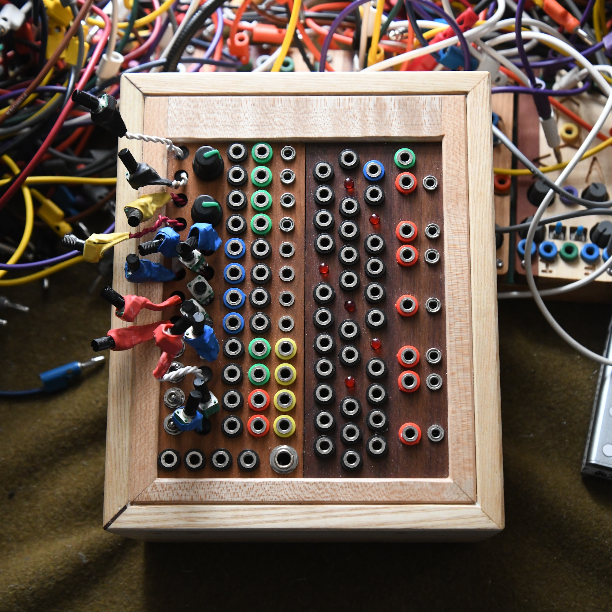
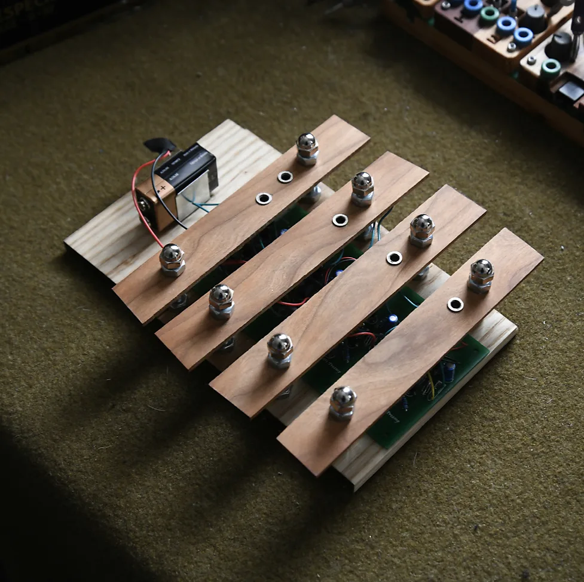

<h1>

ciat lonbarde builds

</h1>

  

Ciat Lonbarde Gyuto Monks Solar Sounder (circuit bent, for use with UV light/blacklight)

<section style="background-color:rgb(1, 1, 2, 0.8); padding: 10px;"

 

 
Dogevox: Switched Lil-SidRollz with Rungling and Dogvoice

ciat lonbarde dogvoice 
ciat lonbarde lil sidrassi 
ciat lonbarde 5 rollz 
ciat lonbarde 4 rollz 
crucFX rungling 

<table border="20px" background="p.jpeg" align="center">
<tr>
<th>
 

  

 

</th>
</tr>
</table>
 
Various Switched Lil-SidRollz Commissions (Commission me! Shoot me an email at femi.fleming@gmail.com)

<h2>$222</h2>
Lil sidrolz is a combination of lil
Sidrassi with a 3 position switch for each hairy cap and a rolz section with 4 rolz and 6 rolz. Will be built into a similar small form factor cigar box. Please allow 3-6 weeks for build time

ciat lonbarde lil sidrassi 
ciat lonbarde 6 rollz (to led) 
ciat lonbarde 4 rollz (to led) 

 
Dogevox v2: Switched Lil-Sidrollz with Dogvoice"

ciat lonbarde dogvoice 
ciat lonbarde lil sidrassi (12 position rate switches for hairy caps) 
ciat lonbarde 6 rollz 
ciat lonbarde 4 rollz 
ciat lonbarde 3 rollz 

 
Rollz 5: Drum and Drama

x2 ciat lonbarde av dogs 
X2 ciat lonbarde gongs 
x2 ciat lonbarde ultrasound filters 
x2 ciat lonbarde 3 rollz 
x2 ciat lonbarde 6 rollz 
ciat lonbarde 5 rollz 
ciat lonbarde 4 rollz 

 
Gyuto Monks, 9v powered, circuit bent with 3 buttons

ciat lonbarde gyuto monks solar sounder

 
Barre Controller (euro jacks, passive) for Mobenthey Modules (5 piezos) 

 
Barre Controller (banana jacks, active) for CL gear 

x2 ciat lonbarde preamp 
x2 ciat lonbarde antipreamp 

</section>
