<code>030924</code>

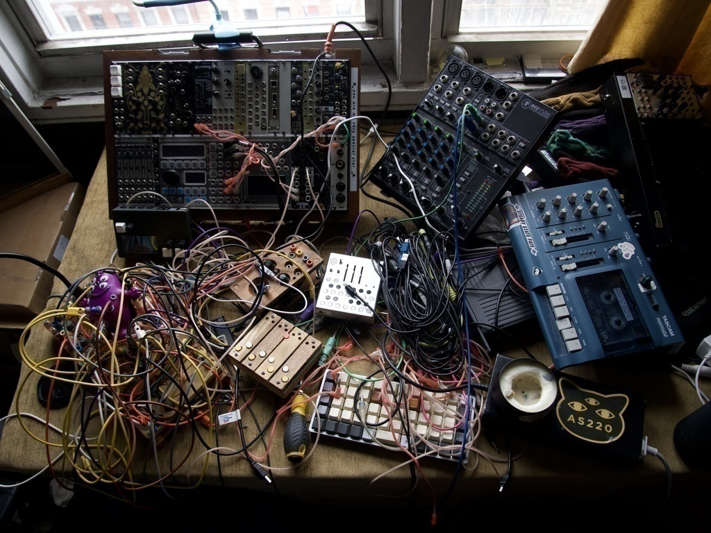

<code>022924</code>

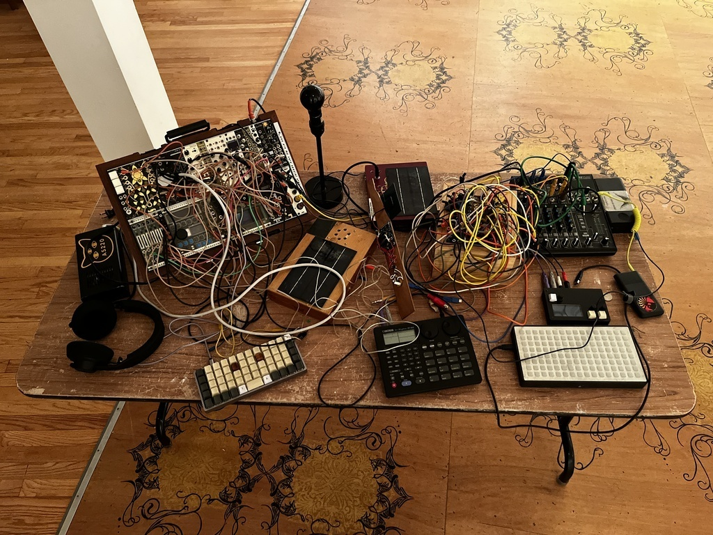

<code>081323</code>

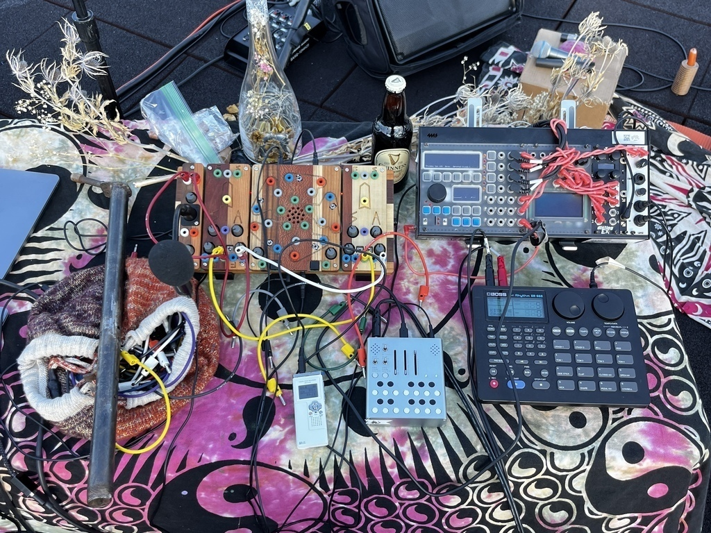

<code>080723</code>

<code>042323</code>

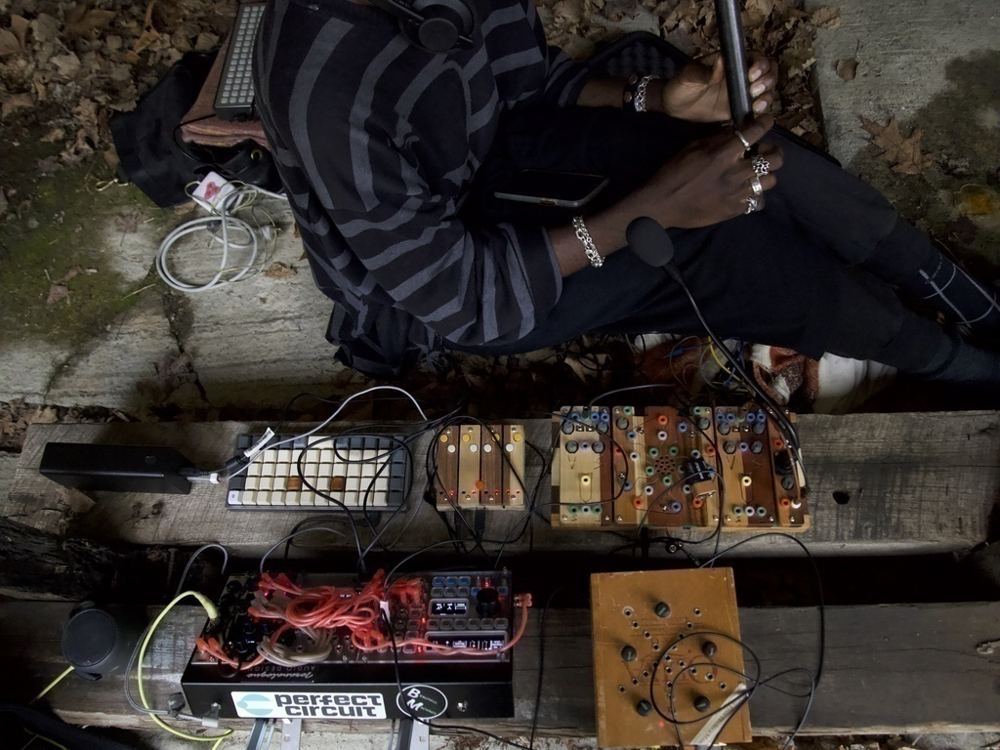

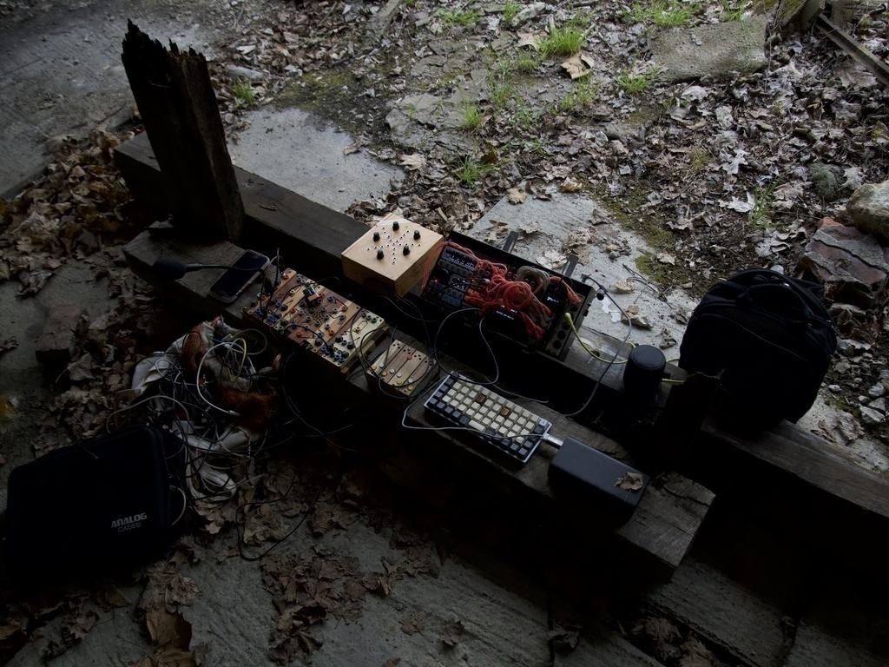

<code>04192023</code>

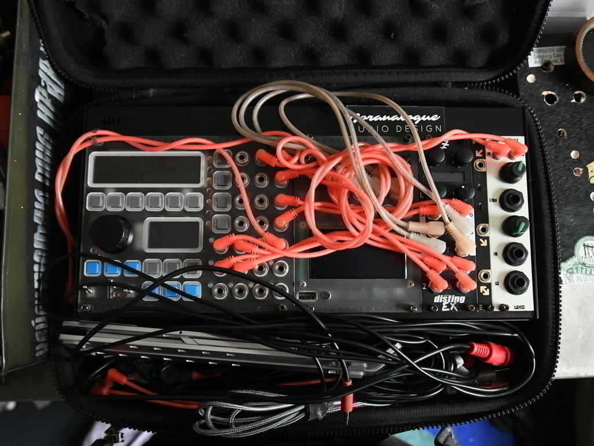

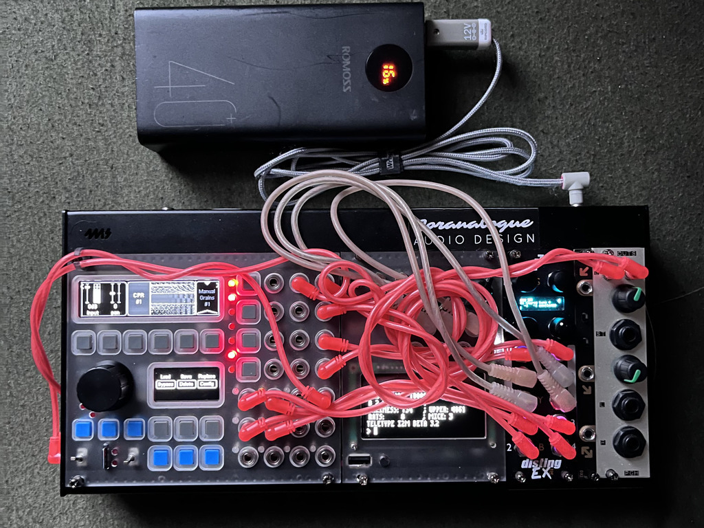

<code>031623</code>

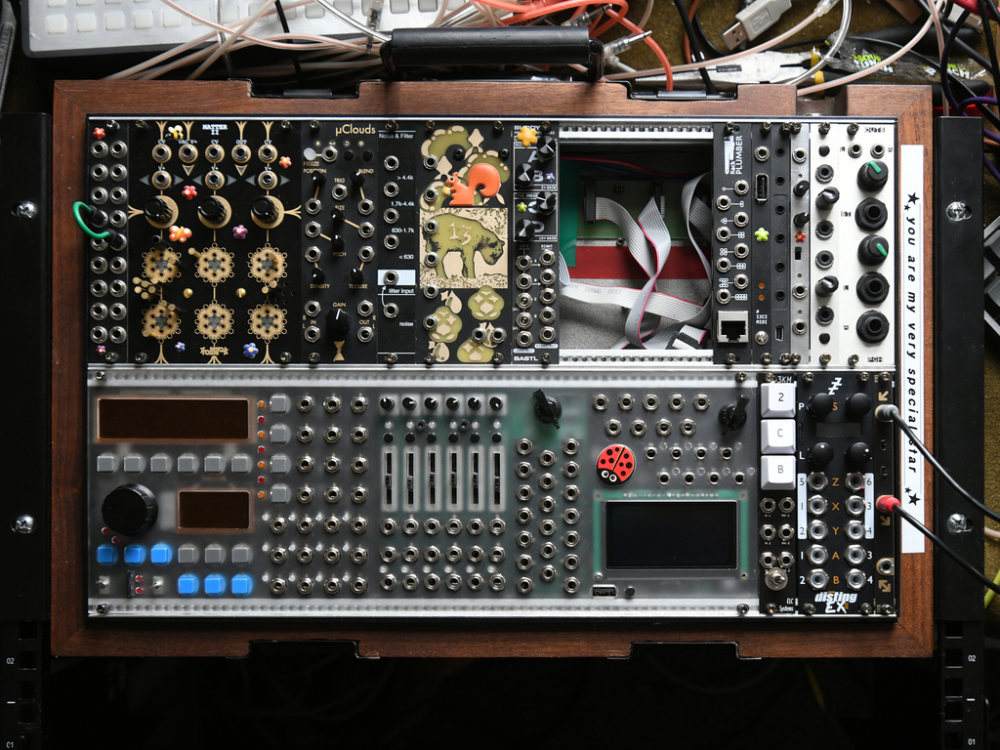

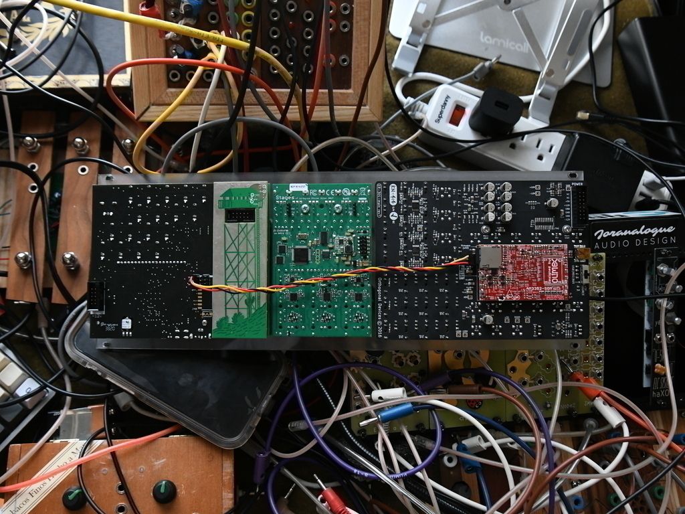

<code>022323</code>

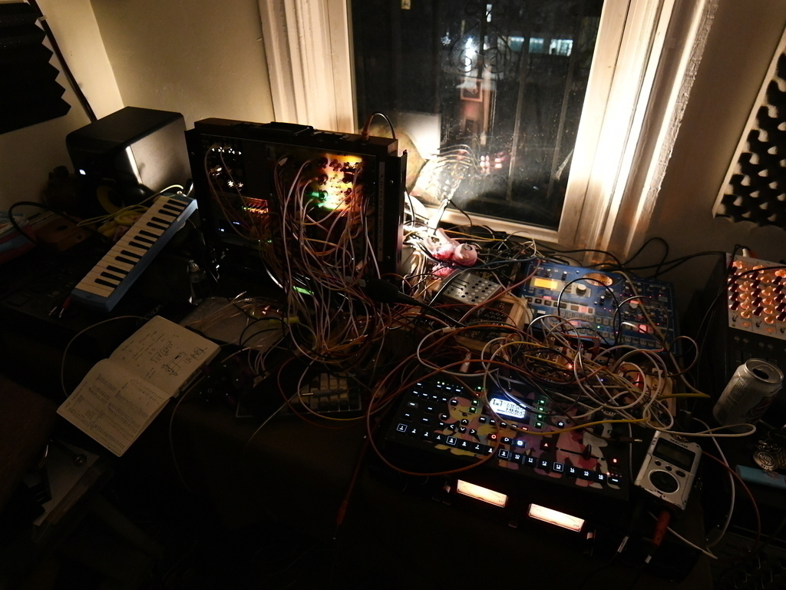

<code>012523</code>

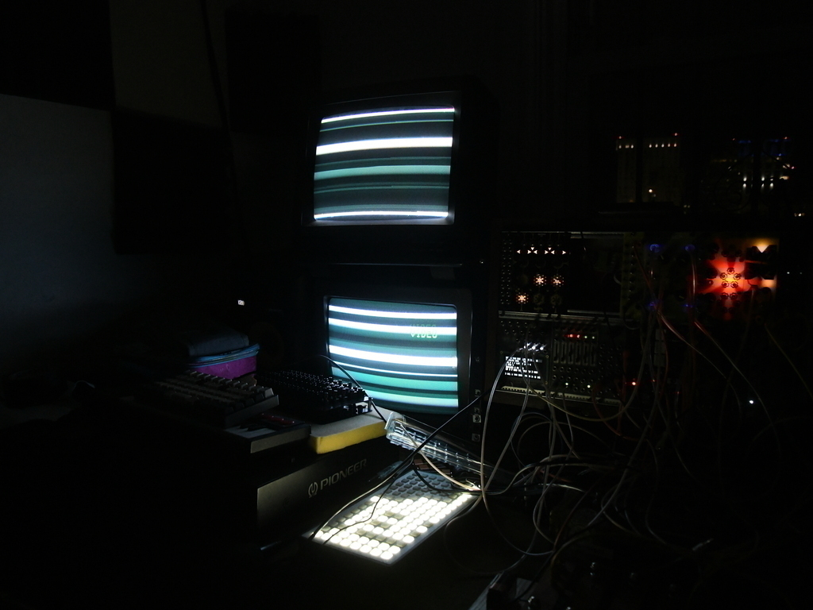

<code>111622</code>

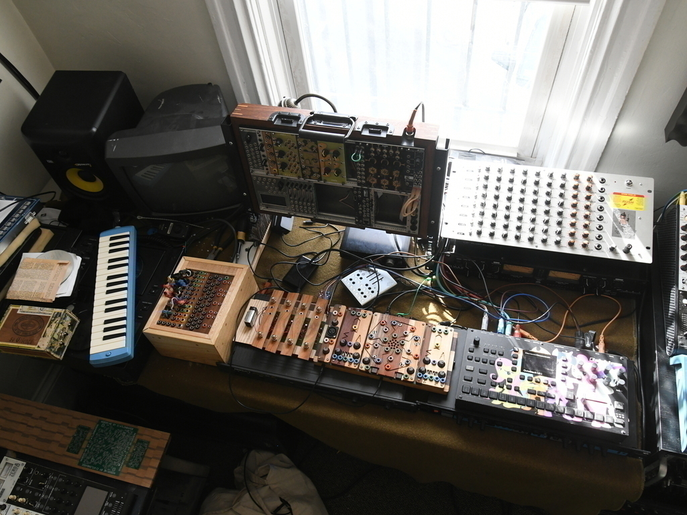

<code>062722</code>

> > My case consists of the following modules 

- Whimsical Raps Cold Mac 
- After Later Audio Monsoon (Clone of mutable instruments clouds with added cv inputs for specific parameters) 
- Plankton Electeonics Envf 
- Catoff Systems Catpaw
- Diy 4 channel two way banana to eurorack format converter 
- Diy 2 channel vactrol low pass gate 
- CruxFx EuRolz
- Folktek Alter 2
- 2hp dual vca 
- Verbos Electronics Noise & Filter 
- Strymon AA.1
- Rack Plumber
- Happy Nerding 4x stereo mix
- Monome Teletype 
- 2x XOXO modular midi/i2c breakout 
- 2x Expert Sleepers Disting EX 
- XL13 Monolith 
- Pittsburgh Modular Outs 
- Monome Crow (not in photo)
- Attowatt i2c2midi (not in photo) 
- Doepfer Usb Power (not in photo) 

<code>052921</code>

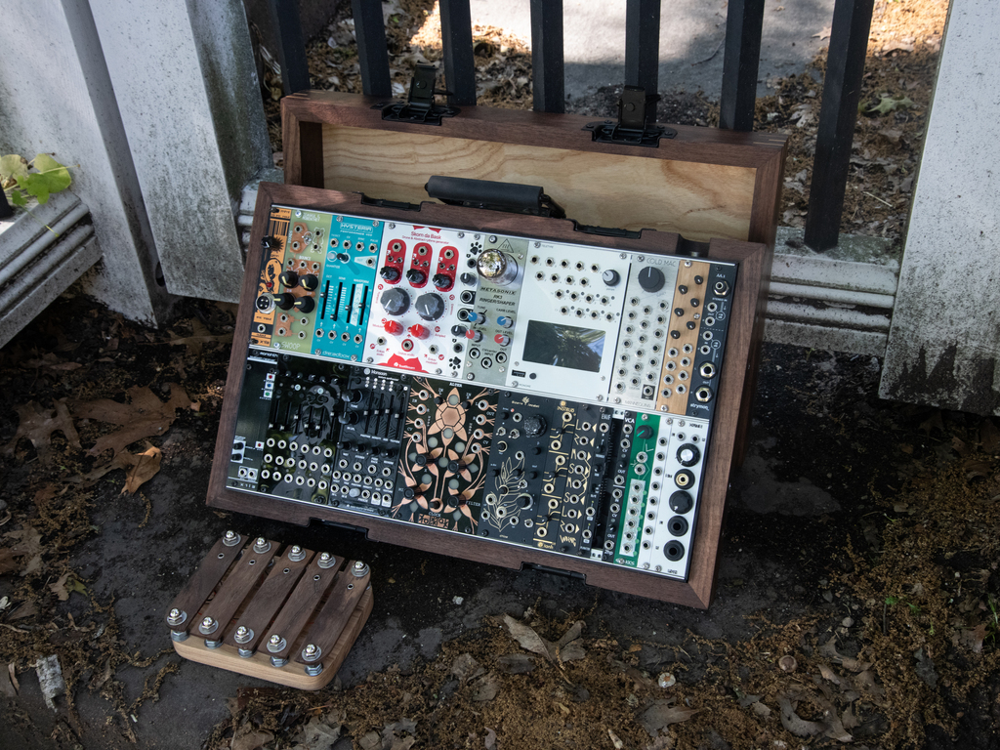

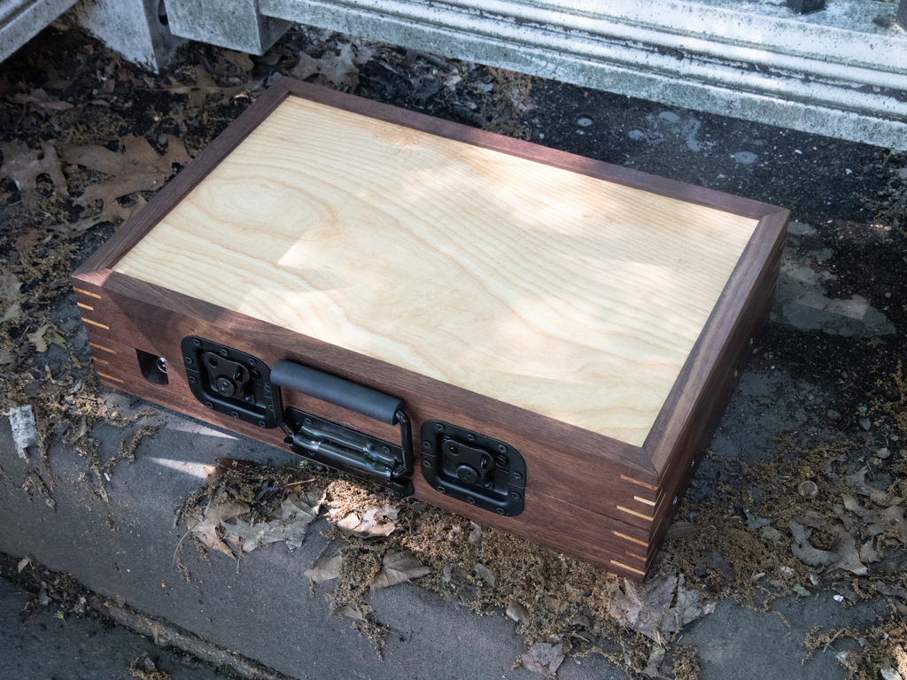

