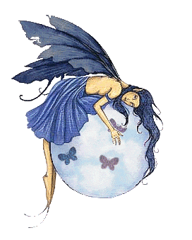

<!doctype html>

<html lang="en">
<head>
    <meta charset="utf-8">
    <title>Femi Shonuga-Fleming</title>
    <meta name="keywords" content="sad, noise">
    <meta name="viewport" content="width=device-width, initial-scale=1.0">
    <link rel="icon" type="image/x-icon" href="favicon.png">

</head>
<body>
    

<body background="dbg.gif" align="center">

<marquee>
<h1 class="flashing-text">dead bitchez global</h1>
</marquee>

 
 
 

</body>
</html><!doctype html>
