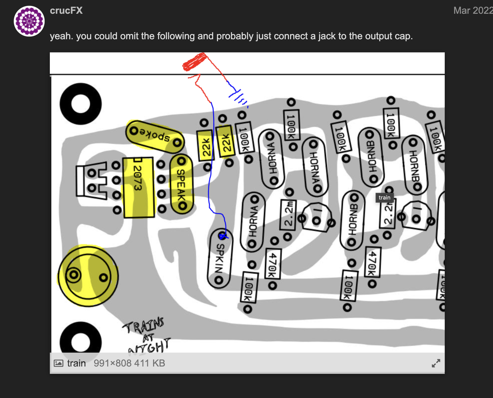

<body background="algotre2.jpeg">
<article>

  <table border="20">
    <tr>
      <th>
        <iframe src="dogevox.html" width="100%" height="300px">
        </iframe>
      </th>
    </tr>
  </table>

Dogevox V2:
*Lil Sidrassi, Dogvoice (in stereo), 6oror, 4oror, 3oror*  
 

 
 

Solar Sounders

A collection of instruemnts made from pcb and [paper](https://llllllll.co/t/mobenthey-ciat-lonbarde-synthmall-thread/3322) circuit [designs](https://www.are.na/femi-fleming/ciat-lonbarde-diy) by [Peter](https://ciat-lonbarde.net/ciat-lonbarde/index.html) Blasser, [CrucFX](https://www.instagram.com/_crucfx_/) and [Graham](https://www.grahamfranz.com) Franz

Thinking about daylight, what are the ways daylight plays into my sonic identify. I make instruments by Peter Blasser, He calls them solar sounders. They are synthesizers, rather sonic instruments. I never know how ro explain an object that creates sound to people who have no background in the subject, but i guess thats what I'm learning, I'de love to teach this stuff someday. The solar sounders are analog electronic instruments built into cigar boxes with a 3w speaker and a 3w solar panel. The amount of volume the speaker outputs is controlled by the amount of sunlight the synth receives. the synth makes birds monks trains traffic and buzzing bees. the wood creates resonance, opening, an environment. The instruments in a series create a spatial audio. The instruments can be performed live at night with a blacklight in a dark room. The chance and probability involve the weather. Nature and wood is so important to my work. My sonic practice is evidently organic. The sounders drone on cloudy days, and are silent on my desk after dusk. 

[Rollz5](rolz5.html) 2xGongs, 2xAVDogs, 2xUltrasound Filters, Various Rolz 
Woodwork in collaboration with Madeleine Young, RISD Furniture 2023 

Circuit bent Korg DDD-5 Drum Machine with 2mm Banana jack patch points and 4 toggle buttons

Switched Lil SidRolz

Lil Sidrassi + 6oror + 4oror

 
 

 
 

 
 

 
 

[DogeVox](https://www.matrixsynth.com/2022/11/ciat-lonbarde-dogevox.html) DogVoice + 6oror + 4oror + Lil Sidrassi + Rungling (By CrucFx)

<table border="20" width="100%">
<tr>
<th>

</th>
<th>

</th>
</tr>
</table>
 
 

<marquee direction="left">
<iframe width="400" src="https://www.youtube.com/embed/6ud8TtjQKQQ?si=Toyi1L7iRjenRDIW" title="YouTube video player" frameborder="0" allow="accelerometer; autoplay; clipboard-write; encrypted-media; gyroscope; picture-in-picture; web-share" referrerpolicy="strict-origin-when-cross-origin" allowfullscreen></iframe>
</marquee>

[Paper](BMTPD.pdf) Circuit 

Gerbers (upload these to [Oshpark](https://oshpark.com) to make pcbs): 
*(Thanks to CrucFX for making these)*

[Mouring Dove](rollz5/All%20Gerbers/pcbgerbers/BMT%20-%20Bird.zip)

[Gyuto Monks](rollz5/All%20Gerbers/pcbgerbers/BMT%20-%20Monk.zip)

[Trains at Night](rollz5/All%20Gerbers/pcbgerbers/BMT%20-%20Train.zip)

<marquee direction="right">
<iframe width="400"  src="https://www.youtube.com/embed/s1yQeETQndY?si=Hu7IbH6vBmJiJ6YD" title="YouTube video player" frameborder="0" allow="accelerometer; autoplay; clipboard-write; encrypted-media; gyroscope; picture-in-picture; web-share" referrerpolicy="strict-origin-when-cross-origin" allowfullscreen></iframe>
</marquee>

Omit Speaker on Trains at Night: 
[TDA2822](https://www.taydaelectronics.com/tda2822-audio-amplifier-1-channel-mono-headphones-2-channel-class-ab-1wx1at32-ohm-1-8v-15v-pdip-8.html) seems to work perfectly fine in place of the NJM2073.

<audio controls autoplay style="visibility: hidden">
  <source src="Sadnoise%20-%20DogeVox%20Demos%20-%2004%20dogevox%20into%20%E5%AD%9F%E5%A5%87wingie2%201-1-1.mp3" type="audio/mpeg">
</audio>

</article>

