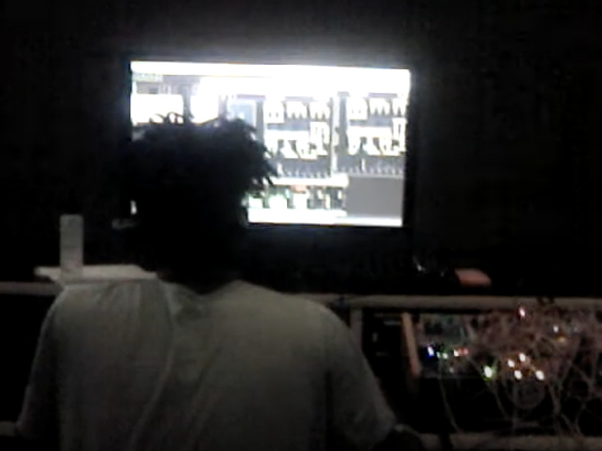

[Performance](https://www.youtube.com/watch?v=gOkqV2hHVS0) for Spatial Audio Spring Semester

In this work I experiment with mapping synthesized sounds in an imaginary, impossible space using and abusing 3rd order ambisonics spatialization techniques. I wanted to focus on the conversation between organic and synthesized sounds, and creating the organic from the synthetic. All sounds in this piece were synthesized. This piece was originally performed at the 25.4 hemisphere speaker array at RISD. The performance was recorded on 24 channels and decoded to stereo binaural.

There is a full [album](https://sadnoise.bandcamp.com/album/hyperencoder) attached to this project with all of my assignments from the course,

along with a [remix](https://sadnoise.bandcamp.com/album/hyperencoder-remixes) EP

