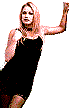

<marquee direction="left" scrollamount="50" >
<!-- The word whose letters' colors will change -->
  
BLA BLA BLA BLA BLA NOT LISTENING WHO CARES IDGAF I DID THIS PAGE FOR FUN WHO ARE YOU SEND ME AN EMAIL TALK TO ME I WANNA HEAR WHAT YOU HAVE TO SAY DO YOU EVEN CARE DO I EVEN CARE WTF WTF WTF LOL LOL XD OMGFG

  
</marquee>

<marquee direction="down" scrollamount="7">
<table border="2" background="walkin_babe.gif" cellpadding="6px" bordercolor="tomato">
  <tr>
    <th>
<marquee direction="up" scrollamount="12">
<table border="30" background="sx4.gif" bordercolor="pink">
  <tr>
    <th>

<table background="sexi2.gif" border="20" cellpadding="10px" bordercolor="beige"><tr><th></th></tr></table>

<marquee>
<section>

    Consolidate
    

    <a href="arch.html">Architecture</a> 
    <a href="textiles.html">Textiles Work</a> 
    <a href="sound.html">Sound Work</a> 
    <a href="algtre.html">Above</a><a href="beneath.html">Beneath</a> 
    <a href="https://sadnoise.bandcamp.com">Bandcamp</a> 
    <a href="dajpg.html">Modular Synth Setup Archive</a> 
    <a href="diy.html">DIY Electronics</a> 
    <a href="code.html">Code</a> 
    <a href="https://www.youtube.com/channel/UCDMKN93aTUykTHz7tOQKw3A">Youtube</a> 
    <a href="log.html">log</a> 
    <a href="screenshotgarden/index.html">screenshot garden</a> 
     
     
    

Femi is an architect and sound artist from New York who works with various synthesis techniques and live coding languages to discuss the organic within electronics and technology through sound art and composition. His work explores the intersections of sound and space though spatial audio and architectural design as an experimental practice. He’s most interested in generative systems, chance, texture within sonic soundscapes. Femi’s architectural work explores indigenous ritual practice as a vessel for conversation between sound, space and interactions of the body. Femi has been performing as a solo experimental electronic improvisation artist since 2018 as sadnoise. Musical and Festival performances include Ende Tymes (2022, New York), Creative Code Festival (2020, New York), Waterworks Festival (2024), Slabfest (2024), amongst others. 

Femi is currently stu<a href="dbg.html">d</a>ying <a href="arch.html">architecture</a> at RISD (after a year in 2019 in <a href="textiles.html">textiles</a>), 
installs <a href="sound.html">work</a> that discusses the con<a href="victoria.html">v</a>ersation between our ears and the <a href="https://www.youtube.com/watch?v=Sd9oe2l8KM4&amp;list=PL9PHlNXlpafKfYjTxSiDPazwz1W0A_m4K&amp;index=13">ground</a> <a href="algtre.html">above</a> and <a href="beneath.html">beneath</a> our feet, 
<a href="shows.html">performs</a> <a href="ritual.html">rituals</a> as <a href="https://sadnoise.bandcamp.com">sadnoise</a>, 
makes sounds using <a href="dajpg.html">digital/analog</a> synthesis, <a href="diy.html">DIY</a> electronics and <a href="code.html">code</a> based languages using <a href="random.html">random</a>,
<a href="atc.html">chance</a> based systems, 
<a href="ass.html">DJs</a> and produces dub techno/micro house under the alias <a href="https://blakkcatrecords.bandcamp.com/album/airing-ep">Ṣonuga</a>, 
<a href="https://www.youtube.com/channel/UCDMKN93aTUykTHz7tOQKw3A">uploads</a> tutorials, music videos, patches, live shows<a href="inde2.html">,</a> 
and update<a href="screenshotgarden/index.html">s</a> <a href="log.html">log</a> occasionally. 

 

<h1>

</h1>
 

 

 
 

<marquee behavior="alternate" scrollamount="2" bgcolor="#303136">
you are visitor number: 
</marquee>
</section>
 
 
 
<link href="https://melonking.net/styles/flood.css" rel="stylesheet" type="text/css" media="all" />

<svg id="flood" viewBox="0 24 150 450" preserveAspectRatio="none" shape-rendering="auto" style="display: block; top: 93%;">
		<defs>
			<path id="gentle-wave" d="M-160 44c30 0 58-18 88-18s 58 18 88 18 58-18 88-18 58 18 88 18 v450h-352z"></path>
			<pattern id="water" patternUnits="userSpaceOnUse" width="28" height="28">
				<image xlink:href="bluegrey.png" x="0" y="0" width="28" height="28"></image>
			</pattern>
		</defs>
		<g class="wave">
			<use xlink:href="#gentle-wave" x="48" y="0"></use>
			<use xlink:href="#gentle-wave" x="48" y="3"></use>
			<use xlink:href="#gentle-wave" x="48" y="5"></use>
		</g>
</svg>

		Coastal flood warning is in effect at 0100 hours.
		<a href="https://melonking.net/free/software/flood.html" target="_blank"><button>🪣</button></a>

 
 
<marquee behavior="scroll" direction="left" scrollamount="4">
How can we properly acknowledge the displacement and destruction of indigenous land as the gentrification and backwards evolution of music and culture in the underground BIPOC communities in nyc. How can we design a space that bridges the gap between the two cultures and creates a welcoming space for new experimental sonic ritual practice. What are natural ways these interactions can form and what will aid both cultures during the design process. What do these communities need in order to feel welcome both physically and sonically.
</marquee>

<marquee direction="right" scrollamount="50" >
Yeah i bet you like coffee and porn you skicko freak of nature exil menace to society and i bet you miss your ex gf you should totally text her you weirdo
</marquee>
