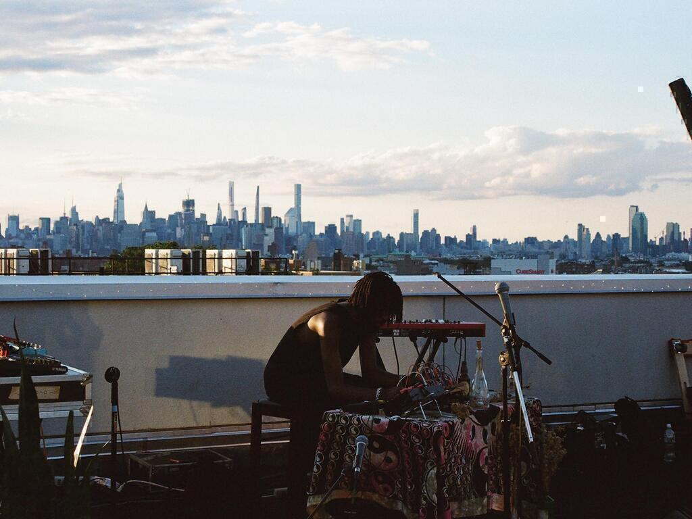

<marquee>
Upcoming Show: Waterworks @ Metropolitan Waterworks Museum 0426/272024 ~Chestnut Hill, MA
</marquee>

*Femi is an architect and sound artist from New York* 

is currently studying [architecture](arch.html) at RISD (after a year in 2019 in [textiles](textiles.html)), 
installs [work](sound.html) that dicusses the conversation between our ears and the [ground](https://www.youtube.com/watch?v=Sd9oe2l8KM4&list=PL9PHlNXlpafKfYjTxSiDPazwz1W0A_m4K&index=13) [above](algtre.html) and [beneath](beneath.html) our feet, 
[performs](shows.html) [rituals](ritual.html) as [sadnoise](https://sadnoise.bandcamp.com), 
makes [sounds](music.html) using [digital/analog](dajpg.html) synthesis, [DIY](diy.html) electronics and [esoteric](https://esolangs.org/wiki/Main_Page) [code](code.html) based languages using [random](random.html),
[chance](atc.html) based systems, 
DJs and produces dub tehcno/micro house under the alias [Sonuga](https://blakkcatrecords.bandcamp.com/album/airing-ep), 
hosts [SRST](https://sound.risd.edu) [Sessions](https://www.youtube.com/@SRSTSessions), a video series highlighting local artists in Providence, RI, 
[uploads](https://www.youtube.com/channel/UCDMKN93aTUykTHz7tOQKw3A) tutorials, music videos, patches, live shows, 
update[s](screenshotgarden/html.html) [log](log.html) occasionally. 

 
 

Recent Changes:

<code>04112024 15:01 Added Solar Sounders to DIY</code> 
 
<marquee>
How can we properly acknowledge the displacement and destruction of indigenous land as the gentrification and backwards evolution of music and culture in the underground BIPOC communities in nyc. How can we design a space that bridges the gap between the two cultures and creates a welcoming space for new experimental sonic ritual practice. What are natural ways these interactions can form and what will aid both cultures during the design process. What do these communities need in order to feel welcome both physically and sonically.
</marquee>

