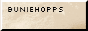

<head>
    <meta charset="UTF-8">
    <meta name="viewport" content="width=device-width, initial-scale=1.0">
    <title>Blur Image on Hover</title>
    
</head>

<marquee direction="left" scrollamount="5">
<!-- The word whose letters' colors will change -->
  
Upcoming Show: SLABFEST @ Jewel Music Venue 0618/192024 ~New Haven, CT

  
</marquee>

    Consolidate
    

    <a href="arch.html">Architecture</a> 
    <a href="textiles.html">Textiles Work</a> 
    <a href="sound.html">Sound Work</a> 
    <a href="algtre.html">Above</a><a href="beneath.html">Beneath</a> 
    <a href="https://sadnoise.bandcamp.com">Bandcamp</a> 
    <a href="dajpg.html">Modular Synth Setup Archive</a> 
    <a href="diy.html">DIY Electronics</a> 
    <a href="code.html">Code</a> 
    <a href="https://www.youtube.com/channel/UCDMKN93aTUykTHz7tOQKw3A">Youtube</a> 
    <a href="log.html">log</a> 
    <a href="screenshotgarden/index.html">screenshot garden</a> 
     
     
    

Femi is an architect and sound artist from New York who works with various synthesis techniques and live coding languages to discuss the organic within electronics and technology through sound art and composition. His work explores the intersections of sound and space though spatial audio and architectural design as an experimental practice. He’s most interested in generative systems, chance, texture within sonic soundscapes. Femi’s architectural work explores indigenous ritual practice as a vessel for conversation between sound, space and interactions of the body. Femi has been performing as a solo experimental electronic improvisation artist since 2018 as sadnoise. Musical and Festival performances include Ende Tymes (2022, New York), Creative Code Festival (2020, New York), Waterworks Festival (2024), Slabfest (2024), amongst others. 

Femi is currently stu<a href="dbg.html">d</a>ying <a href="arch.html">architecture</a> at RISD (after a year in 2019 in <a href="textiles.html">textiles</a>), 
installs <a href="sound.html">work</a> that dicusses the conversation between our ears and the <a href="https://www.youtube.com/watch?v=Sd9oe2l8KM4&amp;list=PL9PHlNXlpafKfYjTxSiDPazwz1W0A_m4K&amp;index=13">ground</a> <a href="algtre.html">above</a> and <a href="beneath.html">beneath</a> our feet, 
<a href="shows.html">performs</a> <a href="ritual.html">rituals</a> as <a href="https://sadnoise.bandcamp.com">sadnoise</a>, 
makes sounds using <a href="dajpg.html">digital/analog</a> synthesis, <a href="diy.html">DIY</a> electronics and <a href="code.html">code</a> based languages using <a href="random.html">random</a>,
<a href="atc.html">chance</a> based systems, 
<a href="ass.html">DJs</a> and produces dub techno/micro house under the alias <a href="https://blakkcatrecords.bandcamp.com/album/airing-ep">Ṣonuga</a>, 
<a href="https://www.youtube.com/channel/UCDMKN93aTUykTHz7tOQKw3A">uploads</a> tutorials, music videos, patches, live shows<a href="inde2.html">,</a> 
and update<a href="screenshotgarden/index.html">s</a> <a href="log.html">log</a> occasionally. 

  

 
 

<marquee behavior="alternate" scrollamount="2" bgcolor="#372D2D">
you are visitor number: 
</marquee>
<marquee behavior="scroll" direction="left" scrollamount="4">
How can we properly acknowledge the displacement and destruction of indigenous land as the gentrification and backwards evolution of music and culture in the underground BIPOC communities in nyc. How can we design a space that bridges the gap between the two cultures and creates a welcoming space for new experimental sonic ritual practice. What are natural ways these interactions can form and what will aid both cultures during the design process. What do these communities need in order to feel welcome both physically and sonically.
</marquee>
 

<link href="https://melonking.net/styles/flood.css" rel="stylesheet" type="text/css" media="all" />

 