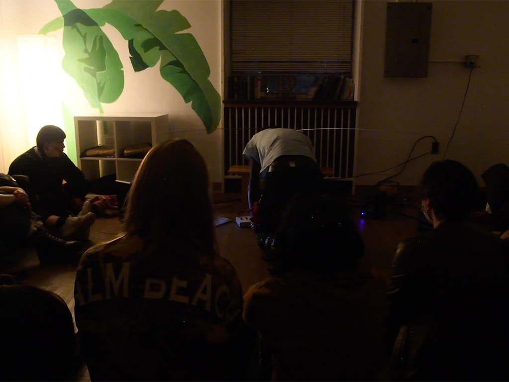
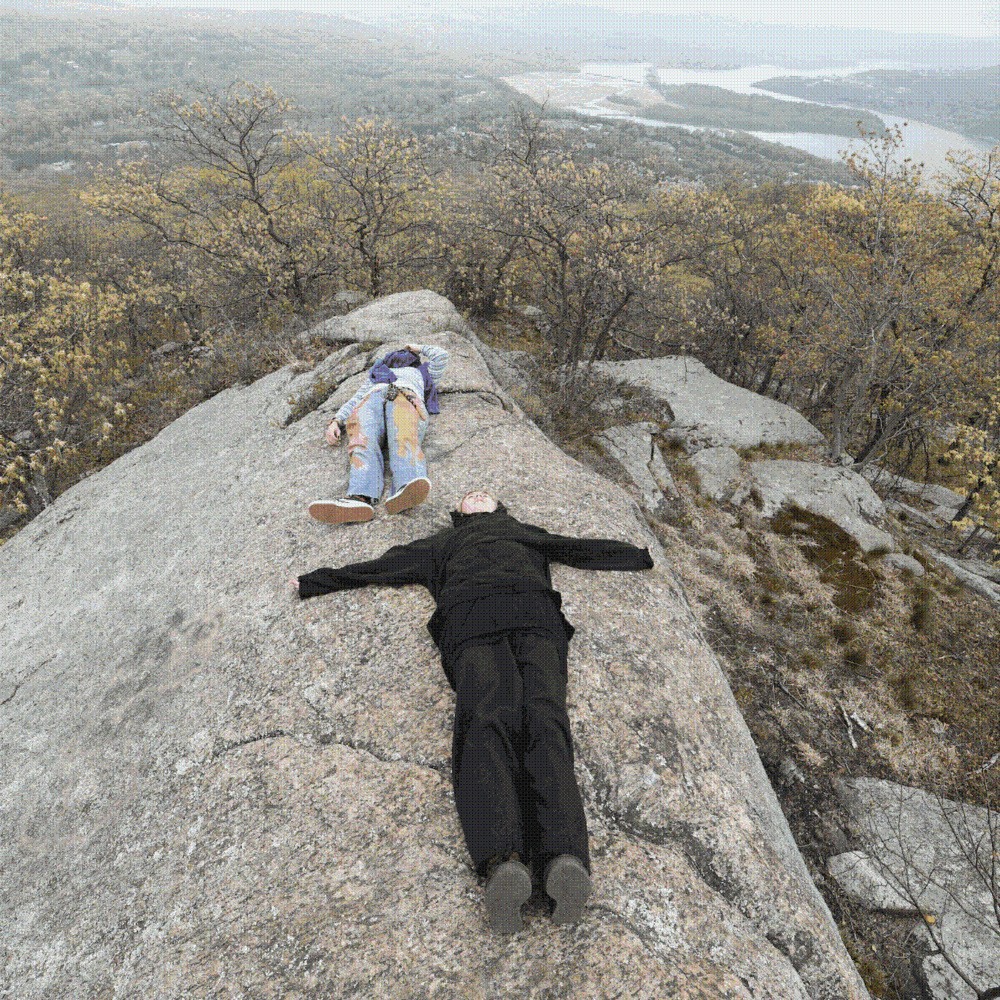
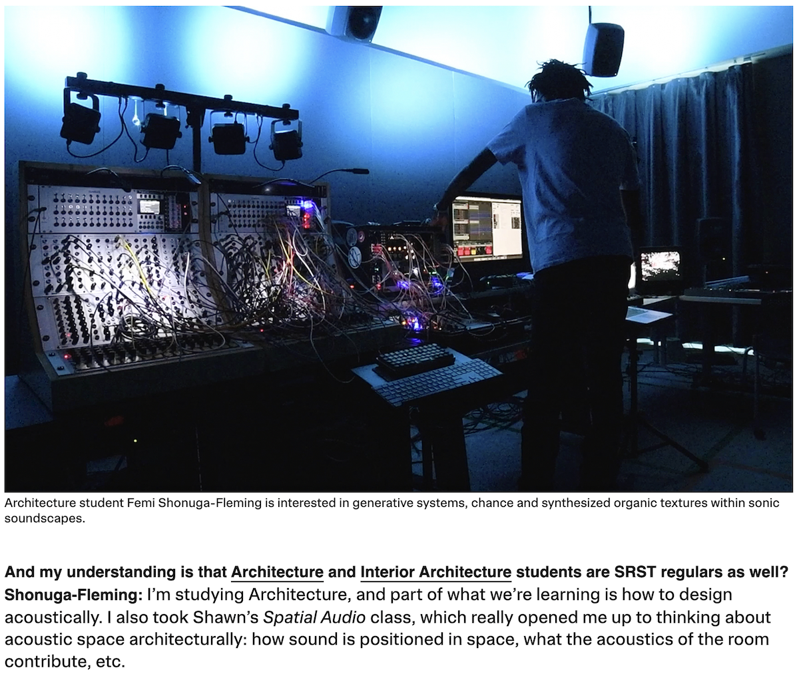
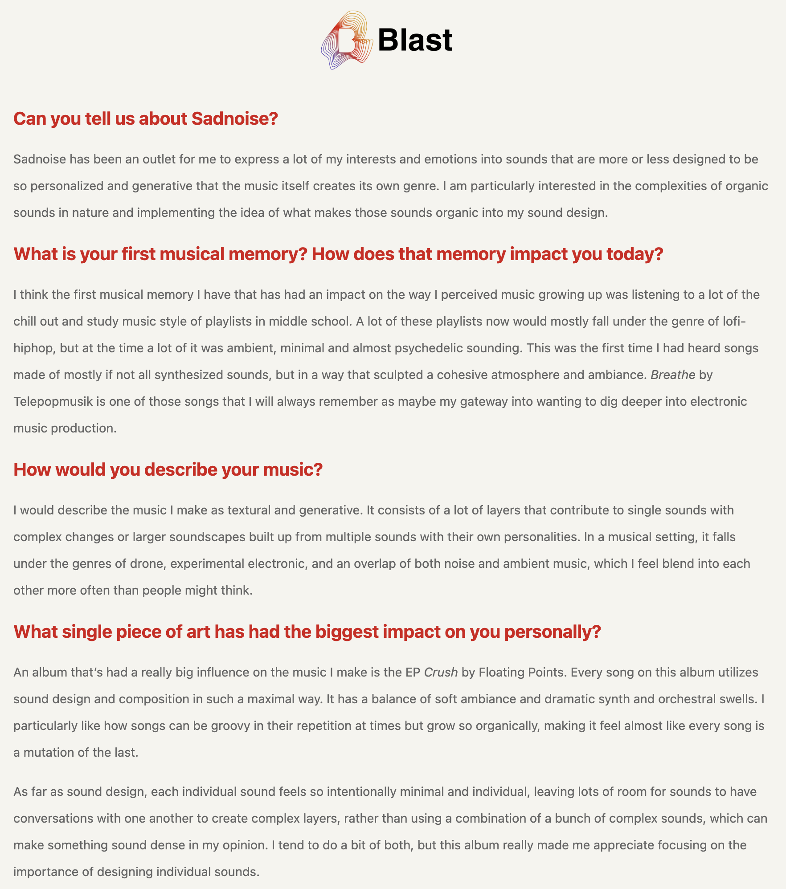
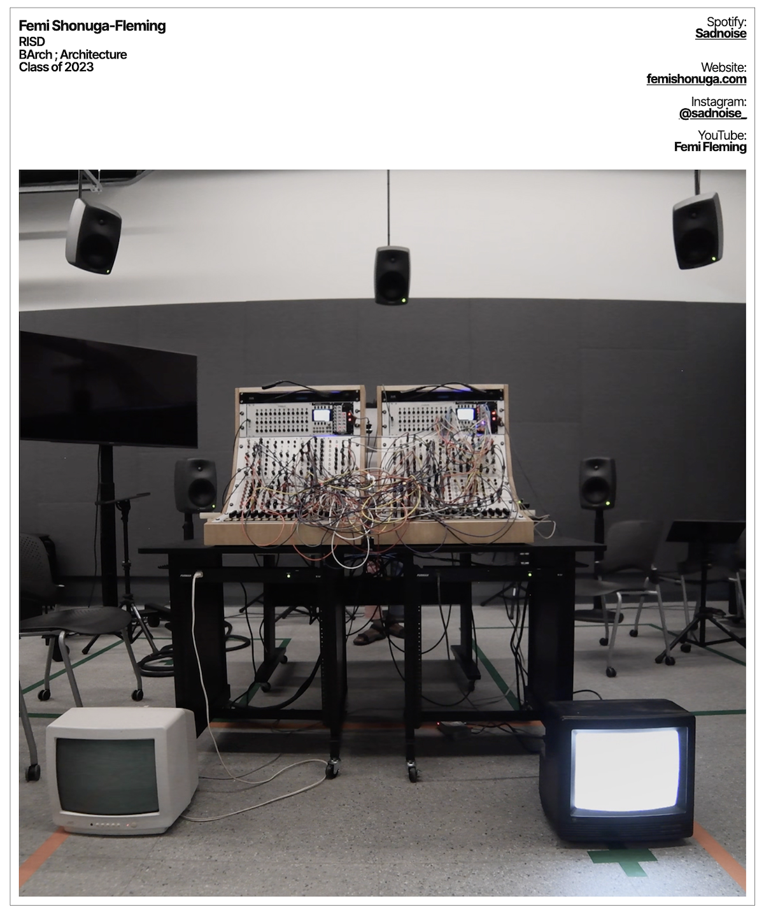
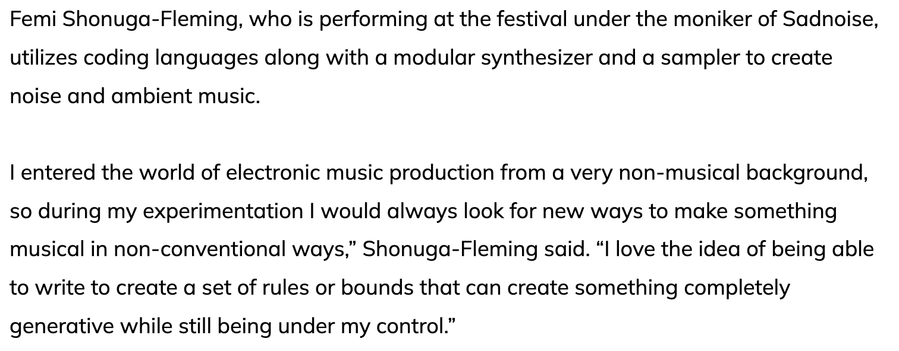
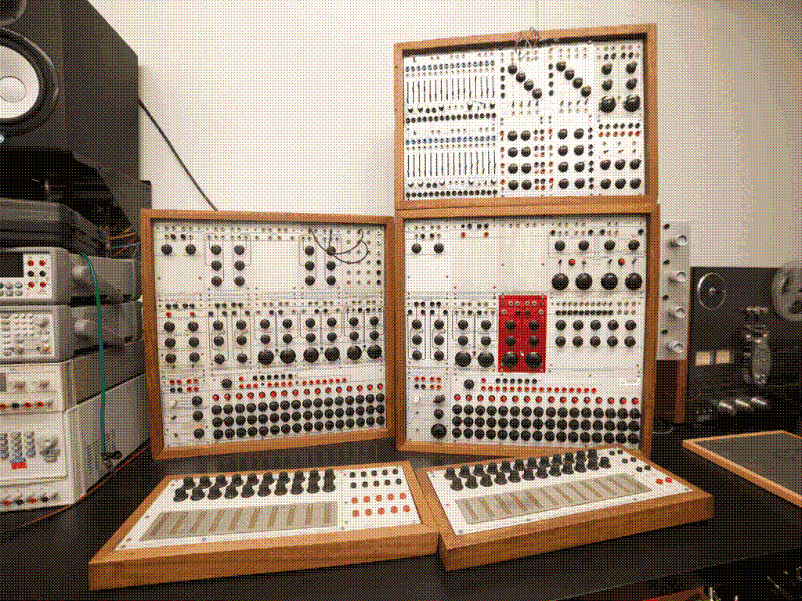

> <code>*October 10th, 2023 - [buffreak](https://maxforlive.com/library/device/10165/buffreak) max for live device*</code>

<iframe width="560" height="315" src="https://www.youtube.com/embed/NPGghA45MIE?si=nql5wUMYZtV90VqW" title="YouTube video player" frameborder="0" allow="accelerometer; autoplay; clipboard-write; encrypted-media; gyroscope; picture-in-picture; web-share" referrerpolicy="strict-origin-when-cross-origin" allowfullscreen></iframe>

> <code>*October 2nd, 2023 - SRST Sessioins 001: Cryptwarblr*</code>

Welcome to the first installation of SRST Sessions. SRST Sessions is a video series highlighting local artists in Providence, RI in an attempt to bridge the gap between music academia at RISD and Brown and the local music scene in providence and the surrounding areas. The SRST or the Studio for Research in Sound and Technology is a 25.4 channel speaker array at RISD used primarily for teaching spatial audio and ambisonics, but has become a space for practice, performance and exploration over the years.

Artist Bio: Cryptwarblr (Alex Bernhardt) is a circuit-bending project investigating bent ROM data in a Casio MT-240 synthesizer. Using homemade patch-bay-and-switchboard array controllers, data carrying lines between the ROM & CPU can be cross-connected in various combinations for unusual sonic effects. These combinations can affect timbre, pitch, adsr, tremolo, gliss, texture, pattern, chord, and tuning, in a bizarre but repeatable way, as long as electric parameters are consistent. Alex’s research in electronics is in how to achieve precise control over small levels of resistance in order to clearly define logic levels across the types of cross-connection combinations. To facilitate music-making, Alex has developed their own hybrid music-electrical notation system and has cataloged hundreds of cross-connections. Their music weaves between combinations of connections in an attempt to explore a sonic landscape painted by the instrument’s offerings.

These events are organized and curated by Femi Shonuga-Fleming with special thanks to Shawn Greenlee, Mark Cetilia and all of the wonderful artists in this series including Cryptwarbler for kicking off the series!

<iframe width="560" height="315" src="https://www.youtube.com/embed/88jHhHF1vAA?si=u3zeu8oryACL5po7" title="YouTube video player" frameborder="0" allow="accelerometer; autoplay; clipboard-write; encrypted-media; gyroscope; picture-in-picture; web-share" referrerpolicy="strict-origin-when-cross-origin" allowfullscreen></iframe>

> <code>*April 22nd, 2023 - Algotrek 3*</code>

SAT 22 April 2023; Cold Spring, NY; Bull Hill 
A celebration for our Mother Earth, in the form of a low-impact walk, and performance. 
2 miles from the Cold Spring Hudson Line station, near the Cornish Estate Ruins. 
Live coding spells will take place in the woods. 

Special thanks to Mark [Denardo](https://www.instagram.com/markdenardo/) for organizing a beautiful event

> <code>*January 23rd, 2023 - Studio for Research in Sound and Technology*</code>

> <code>*August 5th, 2022 - Blast Radio Summer Series*</code>

> <code>*November 4th, 2022 - Ref Mag*</code>

> <code>*July 7th, 2022 - Research in Spatial Audio assisting Shawn Greenlee and Nick Thompson*</code>

[Foafx](https://github.com/risdsound/foafx?ref=codetea.com) - A command line tool for applying spatially positioned audio effects to first order ambisonic sound files

foafx is a command line tool for applying spatially positioned audio effects to first order ambisonic sound files. It is written with Elementary, a JavaScript framework for writing audio applications, and uses its offline-renderer package.

As its input, foafx expects a B-format, 4-channel first order ambisonic encoded file with ACN channel ordering. It supports file normalization either in SN3D or N3D formats.

In order to apply a chosen effect, foafx decodes the B-format file using a simple Sampling Ambisonic Decoder (SAD) into an octahedral arrangement with six vertices that represent virtual microphone positions. Then, the effect is applied with the specified parameters including its spatial position (azimuth and elevation). After effect processing, the six signals are encoded back to B-format, panned to the matching octahedral positions of the decoder, and rendered to an output file. The result is an ambisonic wet/dry effect mix with wet focussed in a specific area of the sound field.

> <code>*April 6th, 2022 - Local musicians look to 'demystify' live coding with New Haven music festival*</code>

> <code>*March 22nd, 2022 - Documentation of the Moog, Buchla and Serge Modular Synthesizers at the Computer Music Center at Columbia University* </code>

