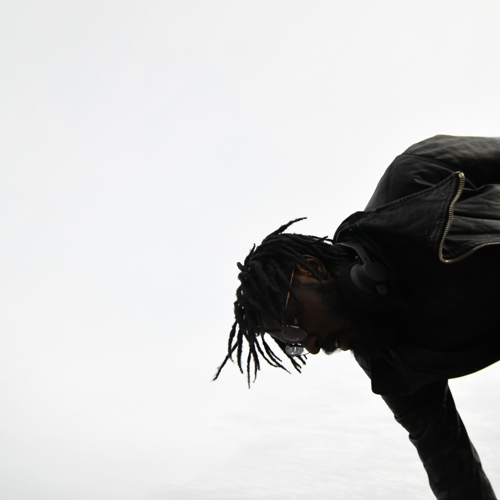

 

Femi is an architect and sound artist from New York who works with various synthesis techniques and live coding languages to discuss the organic within electronics and technology through sound art and composition. His work explores the intersections of sound and space though spatial audio and architectural design as an experimental practice. He’s most interested in generative systems, chance, texture within sonic soundscapes. Femi’s architectural work explores indigenous ritual practice as a vessel for conversation between sound, space and interactions of the body. Femi has been performing as a solo experimental electronic improvisation artist since 2018 as sadnoise. Musical and Festival performances include Ende Tymes (2022, New York), Creative Code Festival (2020, New York), Waterworks Festival (2024), Slabfest (2024), amongst others.

