<!doctype html>

<html lang="en">
<head>
    <meta charset="utf-8">
    <title>Femi Shonuga-Fleming</title>
    <meta name="keywords" content="sad, noise">
    <meta name="viewport" content="width=device-width, initial-scale=1.0">
    <link rel="icon" type="image/x-icon" href="favicon.png">

</head>
<body>
    

<head>
    <meta charset="UTF-8">
    <meta name="viewport" content="width=device-width, initial-scale=1.0">
    <title>Comment Section</title>
    
</head>
<body background="oi.jpg" align="center">
    <h1>Leave a Comment</h1>
    <form id="commentForm">
        <label for="name">Name:</label> 
        <input type="text" id="name" name="name" required> 
        <label for="comment">Comment:</label> 
        <textarea id="comment" name="comment" rows="4" cols="50" required></textarea> 
        <button type="submit">Submit</button>
    </form>
    

        <h2>Comments</h2>
        

    

  
</body>
<marquee width="500px" scrollamount="5">
<code>
LAST U04/15/24D APRIL 14 2024 01:23
</code>
</marquee>

<table align="center" border="72" cellpadding="3" cellspacing="4" bordercolorlight="#378472" bordercolordark="#938234">
<tr>
<th>
<table align="center" border="20" cellpadding="3" cellspacing="4" bordercolorlight="#839248" bordercolordark="#938234">
  <tr>
    <th>
    <a href="https://www.youtube.com/watch?v=l4FgwmNdrfk"><button></button>
    </a>
    </th>
    <th>
    <a href="https://www.oliviaspringberg.com"><button></button>
    </a>
    </th>
    <th><button></button></th>
  </tr>
    <tr>
    <th><button></button></th>
    <th><button></button></th>
    <th><button></button></th>
  </tr>
    <tr>
    <th><button></button></th>
    <th><button></button></th>
    <th><button>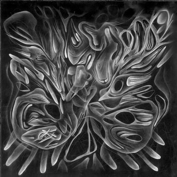</button></th>
  </tr>
    <tr>
    <th><button></button></th>
    <th><button>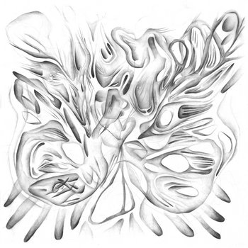</button></th>
    <th><button></button></th>
  </tr>
    <tr>
    <th><button>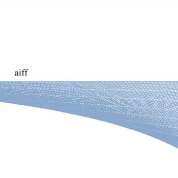</button></th>
    <th><button>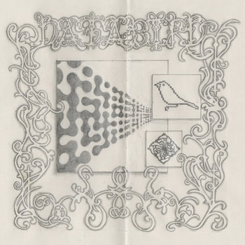</button></th>
    <th><button>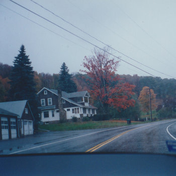</button></th>
  </tr>
    <tr>
    <th><button></button></th>
    <th><button>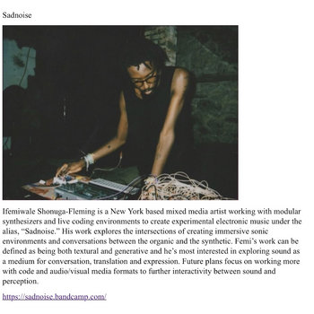</button></th>
    <th><button>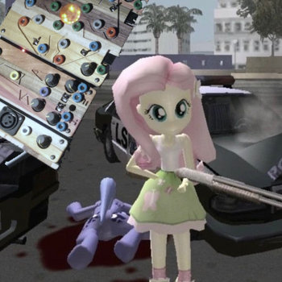</button></th>
  </tr>
    <tr>
    <th><button>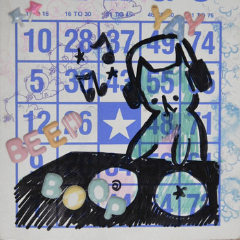</button></th>
    <th><button>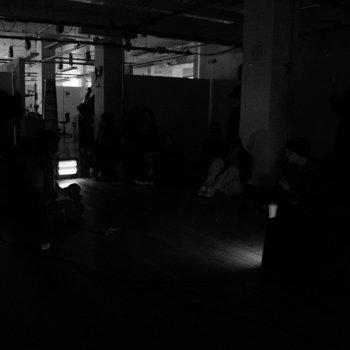</button></th>
    <th><button>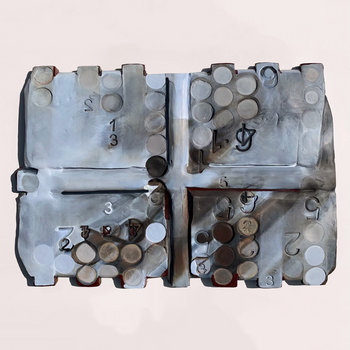</button></th>
  </tr>
    <tr>
    <th><button></button></th>
    <th><button></button></th>
    <th><button></button></th>
  </tr>
    <tr>
    <th><button></button></th>
    <th><button></button></th>
    <th><marquee></marquee></th>
  </tr>
</table>
</th>
</tr>
</table>

 

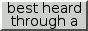 

</body>
</html><!doctype html>
