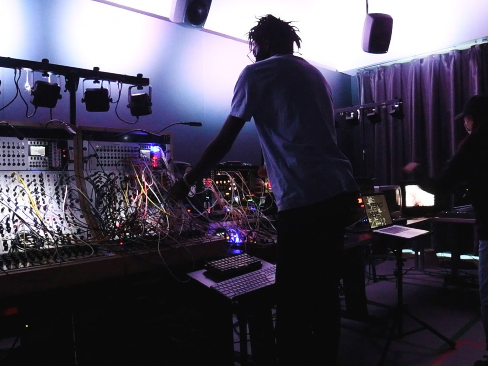
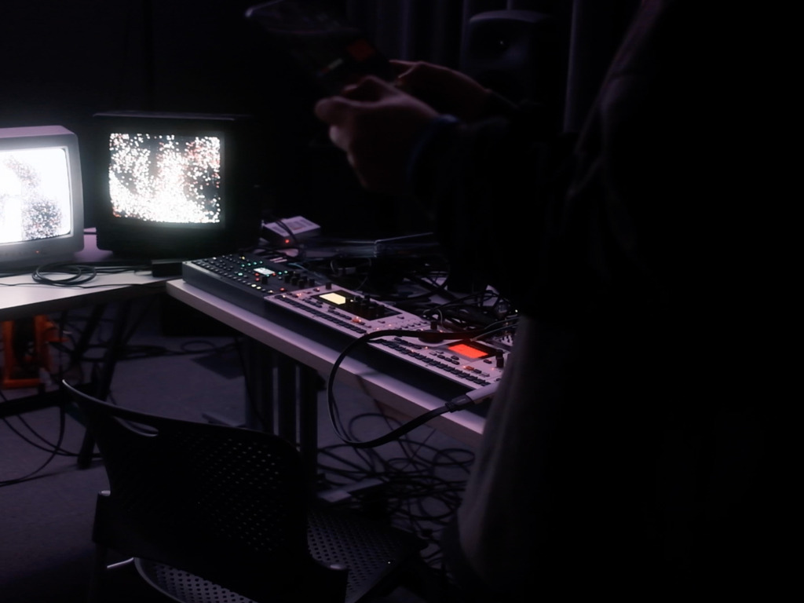
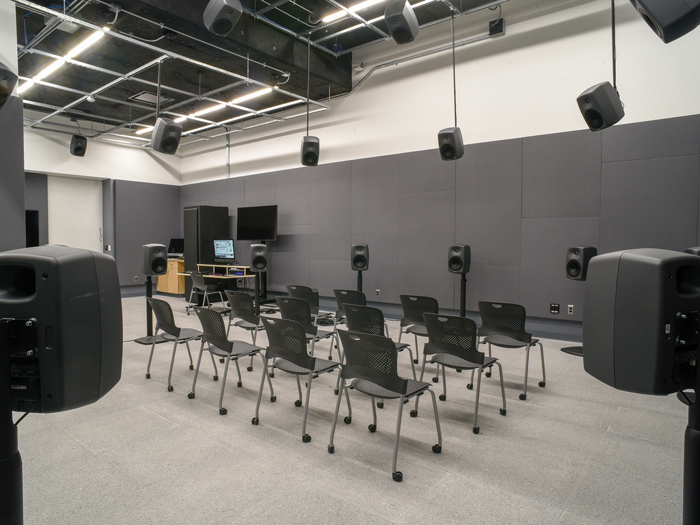

[Performance](https://www.youtube.com/watch?v=ZAf_YS2hjrg) for Of Sound and Vision Wintersession Course in collaboration with [Haram](https://www.instagram.com/haaa.raam/) Lee

Using the Serge Modular Synthesizer, My personal [Eurorack](dajpg.html) Modular Synth, Max MSP, Reaper, The [25.4](https://sound.risd.edu/Loudspeaker-Array) Speaker Array and the Electron Monomachine, Machinedrum and Octatrack

