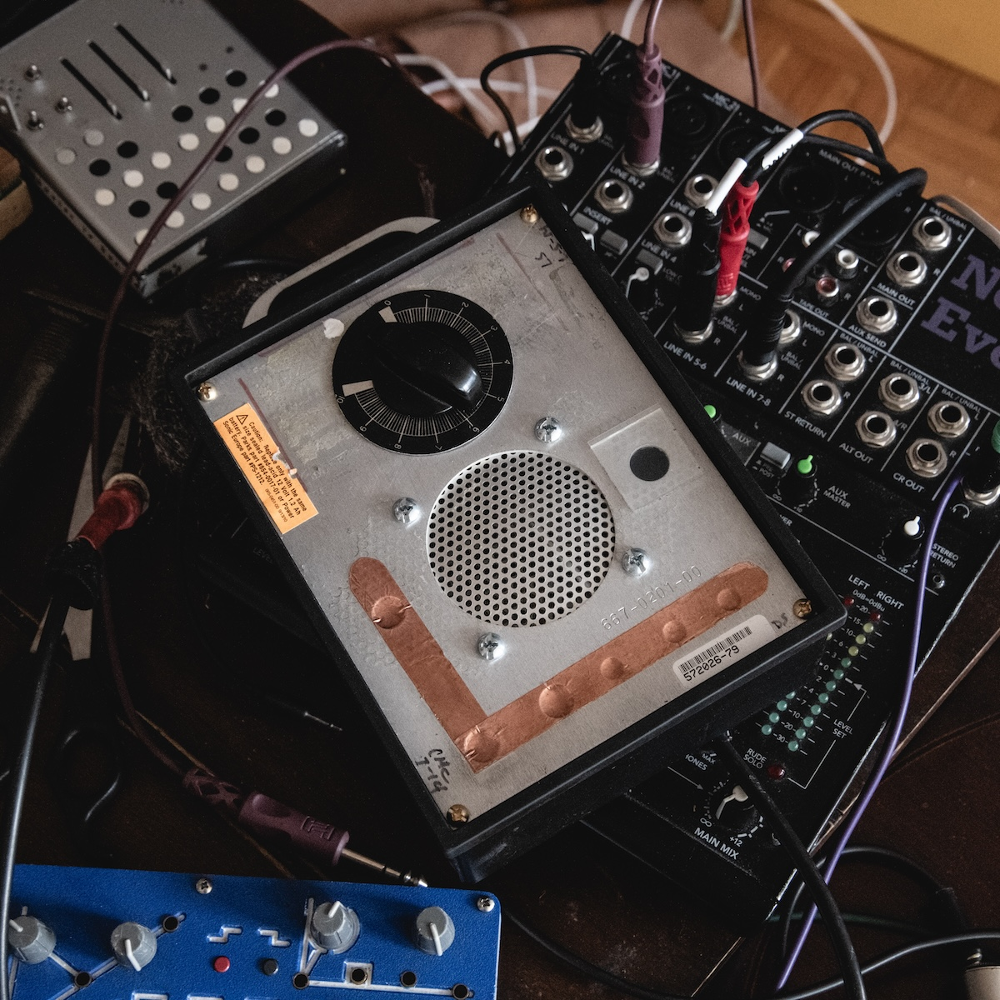
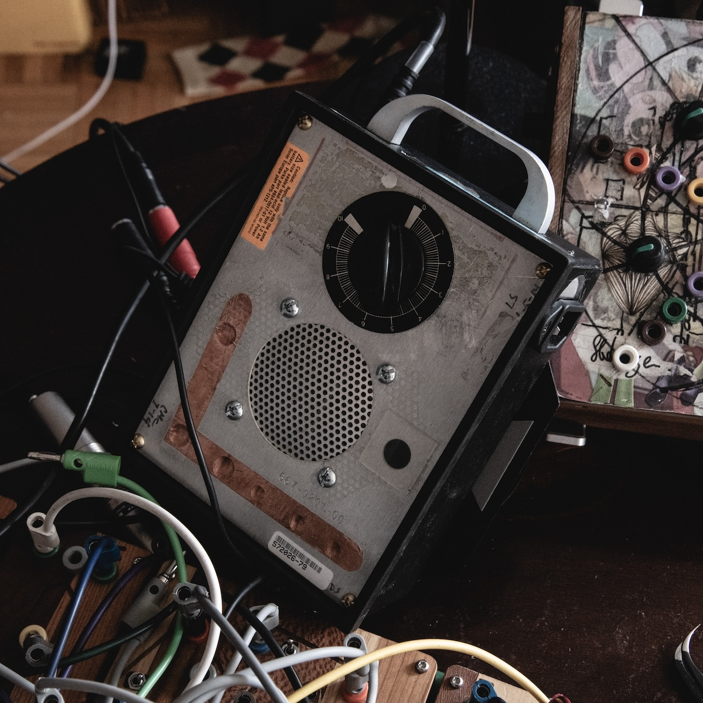
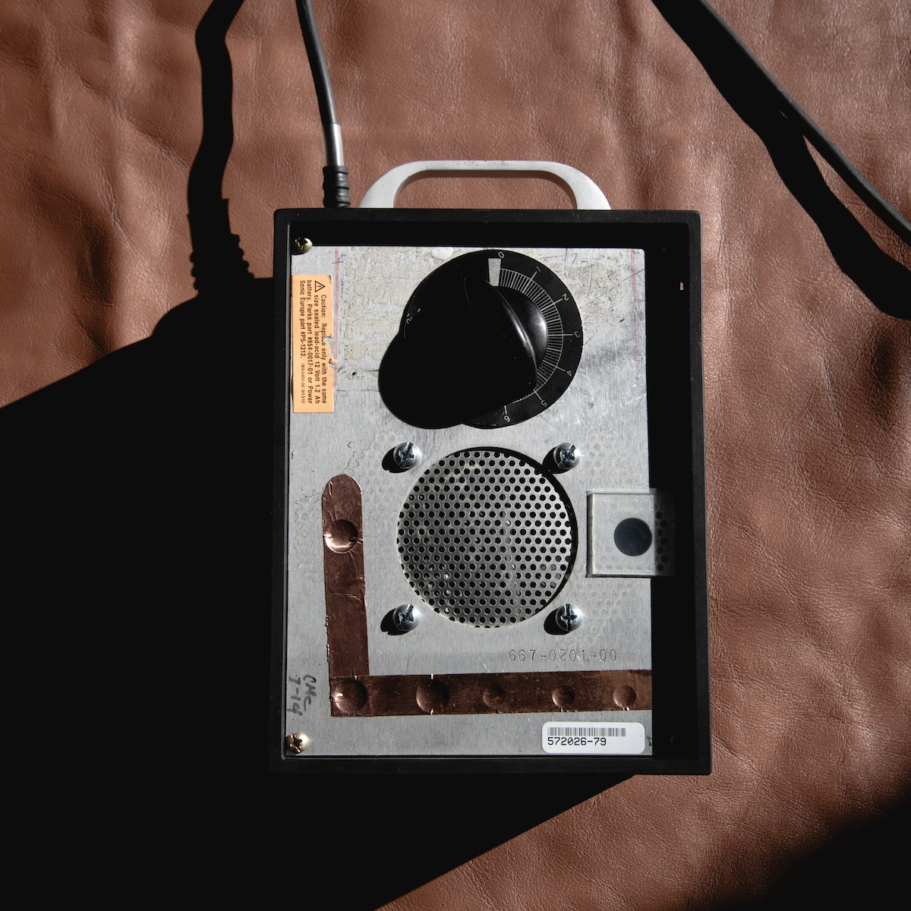
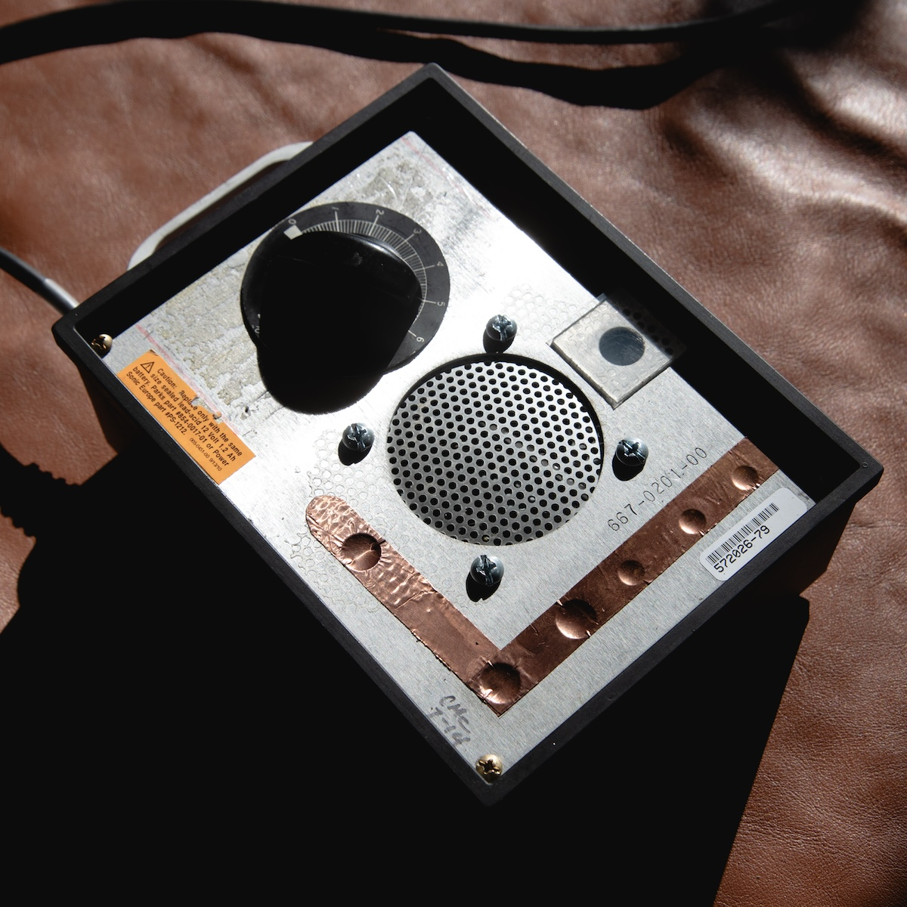
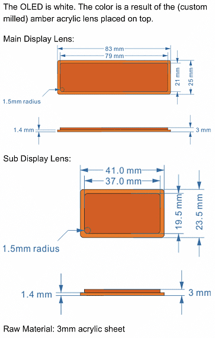
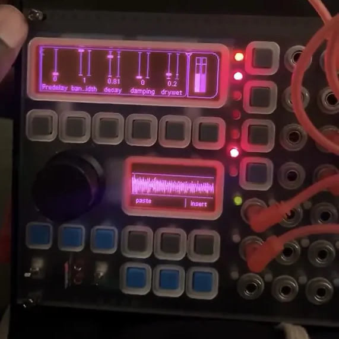
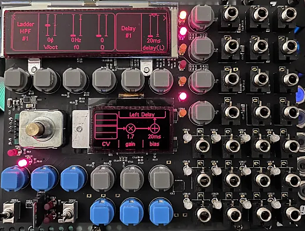
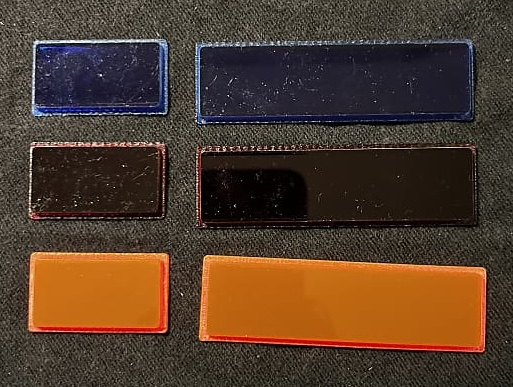

<!doctype html>

<html lang="en">
<head>
    <meta charset="utf-8">
    <title>Femi Shonuga-Fleming</title>
    <meta name="keywords" content="sad, noise">
    <meta name="viewport" content="width=device-width, initial-scale=1.0">
    <link rel="icon" type="image/x-icon" href="favicon.png">

</head>
<body>
    

<body background="er301.gif">
	<h1>
Analog Timer Eurorack Power Supply
	</h1>
	 
	 
	<h1>
My Custom Eurorack Module Panles in Plexi, Cherry and Walnut
</h1>

<h1>
Custom Screen Inlays for ER301 Sound Computer
</h1>
<table border="9px" background="er301.gif">
<tr>
<th>
 

</th>
</tr>
</table>

</body>
</html><!doctype html>
