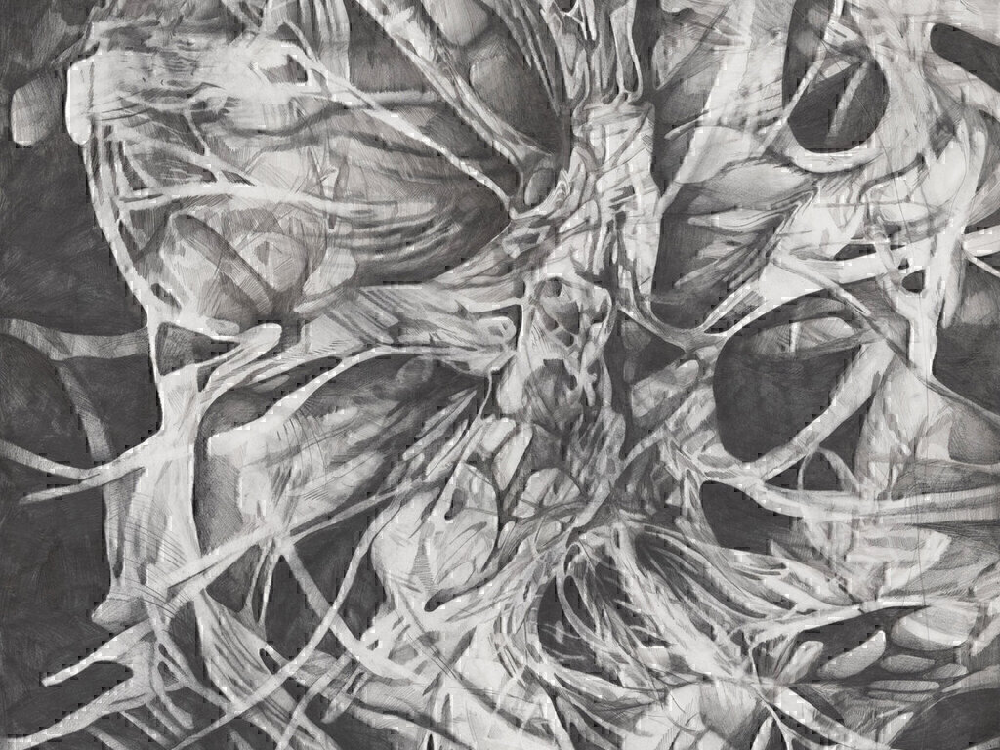

[RITUAL](https://sadnoise.bandcamp.com/album/ritual) is the first release in a series of Albums I'll be releasing every month for a year as part of my thesis. This series focuses on ideas of sound as ritual practice along with themes of [architecture](arch.html), [dreams](dreams.html), land acknowledgment, academia, indigenous practices, sexuality, love and relationships and the [internet](4chan.org). The purpose of this series is to really dive into the idea of recorded improvisation as a ritual practice and generative/[algorithmic](code.html) systems as a connection to nature and the organic/organism. Sadnoise has always been as much about the conversation between the internet and nature or the "absence" of the internet as it has been about the interaction between produced or manipulated sound and physical space.

Artwork by Hannah Rosies

