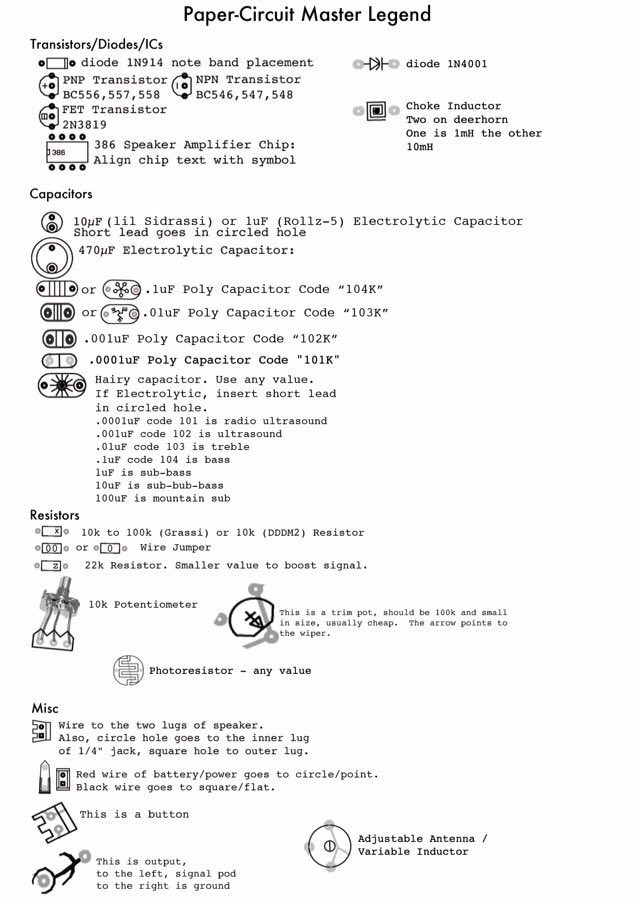
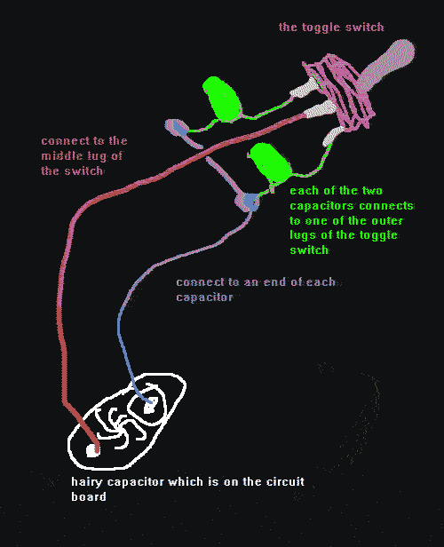
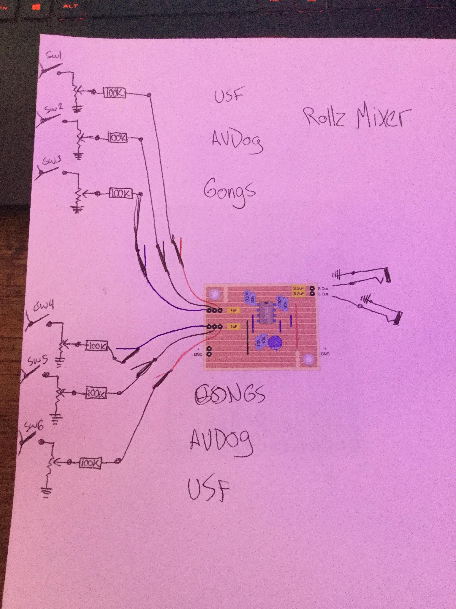
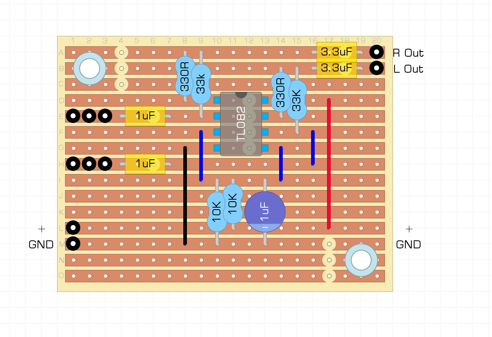

 

Paper Circuits: 
 > [Instructions](rollz5/01b.gif) 
 > [Rollz](rollz5/02.gif) 
 > [Ultrasound FIlters](rollz5/03.gif) 
 > [Gongs](rollz5/04.gif) 
 > [AVDogs](rollz5/05.gif) 

 Mods:
> AVdogs: 
 
  
> Gongs: 
 
  
 2.2m resistor for either x or xx, and 2m trimpot for the other 

> Ultrasound Filters: 
 
>  

> Rollz LED Driver Outputs Mod, node to LED, ground of LED to ground: 
> *(Reccomended for Even Rolz only)* 
 
>  

Golden Master and [more](rollz5/ciat-lonbarde-diy-stuff.pdf): 
 

Gerbers from original [Papers](rollz5/papers.zip): 
*(Upload these to [OSHPARK](https://oshpark.com) to make pcbs)*

> [3oror](rollz5/GerberFiles_3oror.zip) 
> [4oror](rollz5/GerberFiles_4oror.zip) 
> [5oror](rollz5/GerberFiles_5oror.zip) 
> [6oror](rollz5/GerberFiles_6oror.zip) 
> [Ultrasound](rollz5/GerberFiles_ultra.zip) Filters 
> [Gongs](rollz5/GerberFiles_gong.zip) 
> [AVdogs](rollz5/GerberFiles_avdog.zip) 
> [LED](rollz5/uploads_17fb6d7d-b603-48a2-980d-ea79f3d28964_LedDriver.zip) Driver

Capacitor Switches, for Hairy Caps:

Mixer:

> 

> 

