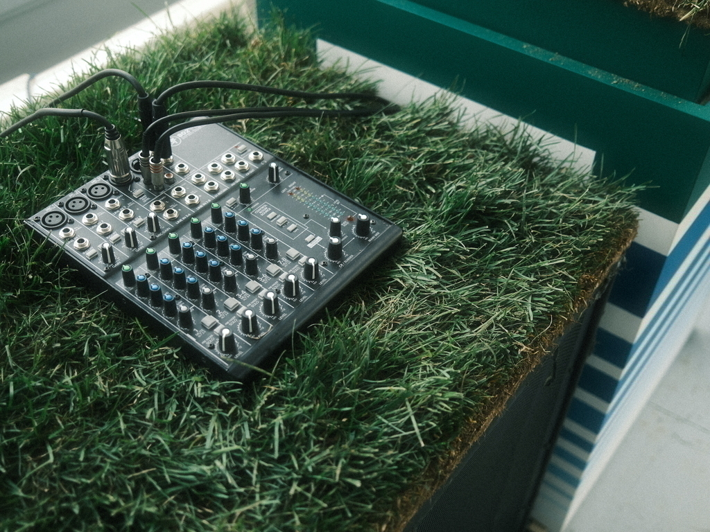
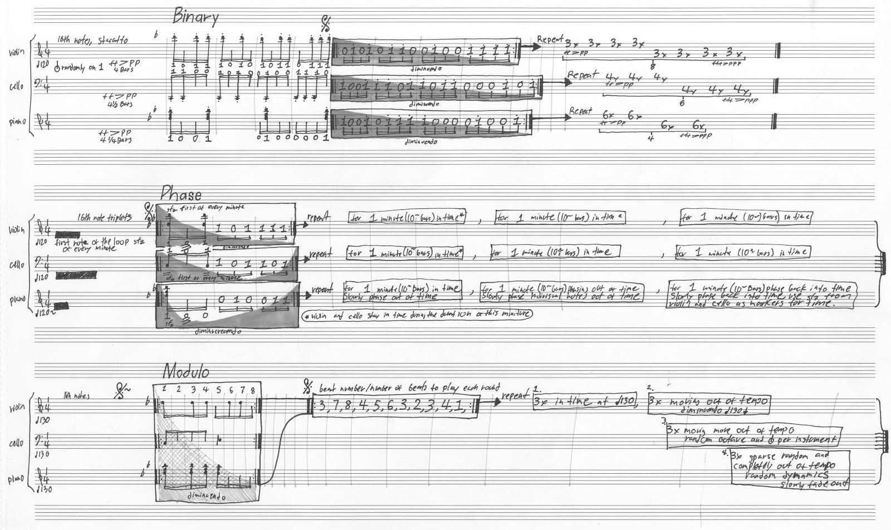

<!doctype html>

<html lang="en">
<head>
    <meta charset="utf-8">
    <title>Femi Shonuga-Fleming</title>
    <meta name="keywords" content="sad, noise">
    <meta name="viewport" content="width=device-width, initial-scale=1.0">
    <link rel="icon" type="image/x-icon" href="favicon.png">

</head>
<body>
    

sound work
    

<a href="sfm.html">042723</a> Spaces for Mediation

<a href="atc.html">020823</a> According to Chance RISD Wintersession 2023

<a href="goblsr.html">011723</a> Grid Ops Binary Left Shift Rotating

<a href="osav.html">021022</a> Performance for Of Sound and Vision Wintersession in collaboration with Haram Lee

<a href="h.html">052121</a> HyperEncoder

<a href="c.html">051921</a> Characters

Four Bit Modulo Phase Triplex for Violin, Piano and Cello.
By Ifemiwale Shonuga-Fleming
  

  

  

  

This score is based off of binary information generated by randomly sampling values of noise from a
recording I made of the environment of a highway underpass at 41 814011, 71 406527 in Providence, RI
Each 1 in the score represents playing a 16th note or chord, preset at the beginning of the movement,
while each 0 represents a rest.
In the first movement the first 4 bars are a notated representation of playing notes on 1s and resting on 0s.
The next 4 bars for violin is a loop, that is to be played 24 times. Within the loop, the grey envelope
overlay is a visual representation of dynamics. In the first 12 loops this dynamic is a representation of ff &gt;
pp, and in the next 12 loops from fff &gt; ppp.
These rules are the same for piano and cello, however the length of the piano loop is 4 and 1/4th bars
long, and the length of the cello loop is 4 and 1/2 bars long. These loops will most likely end at different
times. The violin is notated as 8 sets of 3 loops to make up 24, the piano is notated as 4 sets of 6 loops
each to make up 24 and the cello is notated as 6 sections of 4 loops each to make up 24 loops. Although
these loops will phase in and out of each-other because of their varying loop length and dynamics per
instrument, all instruments are to play 16th notes for this section and keep in time with 120 bpm.
It is also stated in this movement that all on notes (1s) are staccato and for cello and violin to use snap
pizzicato randomly, preferably towards the beginning of the loop when the volume of the particular
instrument is high.
In the second movement, the tempo stays at 120, the 16th notes are now in triplets, and then tempo only
changes for the piano. There’s a new set of preset notes notated at the beginning of the loops. Snap
pizzicatos are not random (if they are too close in succession you can remove the second one from each
bar. The first note of these loops are to be played sfz for violin and cello as a timing indicator for the
piano when it phases out of time.
For roughly the first minute (10 bars) of looping every instrument is to stay in time with 120. Towards the
second minute the piano slows starts to phase out of time, slowly separate the individual notes the piano is
playing, and decrescendo in volume. Towards the end of the movement the piano is to slowly phase notes
and tempo back into time and crescendo in volume to fff and all instruments should be in tempo again by
the last 20 seconds of the movement. Violin and cello should crescendo from mf to fff over the entire
course of the 3 minute movement.
In the third movement the tempo is now 130, and all notes are 16th notes. This movement stays in tempo
for the beginning and over time each instrument moves out of tempo, octave and volume randomly, all
instruments are in one loop and the loop length changes. The cello only plays one note in the loop at the
beginning and it is to be played sfz. The numbers refer to beats long. The first loop is 3 beats long, then 7,
then 8, then 4 etc. after the instruments play this set of loops they are to repeat it 3 times in tempo, 3 times
slowly moving out of tempo, 3 times moving out of tempo volume and octave with random pizzicato for
cello and violin, and then deviate/disintegrate/fall apart for the end of the movement.

Creating a simple kick drum with a modular synth is easy if you have the right tools. You will need an oscillator, two or three envelope generators with control over the shape of the decay (linear vs exponential), two or three vcas, a noise source (optional), your trigger source and stack cables or a multiple.

Start by patching your oscillator into your vca and out to your mixer. Set your oscillator to a relatively low 808 range pitch. Oscillators that have control over the shape are useful for shaping the pre stage distortion of your kick. You can always put the final kick through a distortion of your choice. Oscillators that morph from sine to square are ideal, but experiment with different waveforms. If your oscillator has individual outputs and you want to achieve waveform morphing you can try patching a the sine and square output into a crossfader and use the out of the crossfader to go into your vca instead.

Next chose your trigger source, this can be a looping square wave oscillator, a gate from a sequencer or clock divider or an envelope with a sharp or short enough attack stage. send your trigger or gate to an envelope generator. We will only be using the decay stage of the envelope, so an attack decay envelope generator will work perfect. patch your decay envelope in to the vca, this envelope will control the overall decay of the kick, this envelope should be linear or somewhere between linear and exponential with a slightly long decay.

Make a copy of your trigger source with a stack cable or multiple and patch that into another decay envelope. This envelope will control the punch of the kick. Patch the output of the envelope generator into a separate vca or attenuator, to have control over the amplitude of this envelope. Then patch the output of the vca or attenuator into the pitch of your oscillator. (note if your oscillators pitch input quantizes incoming voltage, you want to go into the FM or frequency modulation input instead. If your FM input has a dedicated attenuator, there is no need to patch the envelope into a vca or attenuator beforehand). This decay envelope should be exponential, we want it to be fast and snappy, to add punch to the very beginning of the kick drum. Slowly let in (open your vca or attenuator) your snappy envelope to control the pitch of the oscillator and ajust to taste. This should give you a basic snappy 808 type techno kick.

To add transient to the punch of the kick, use the same envelope controlling the pitch and another vca with a noise source patched in and mix in the enveloped noise to your kick signal. Play around with the oscillator wave shape to add distortion pre-envelope, and play around with envelope decay times for longer kicks. 

updated 05/28/24 – femi.fleming@gmail.com

</body>
</html><!doctype html>
