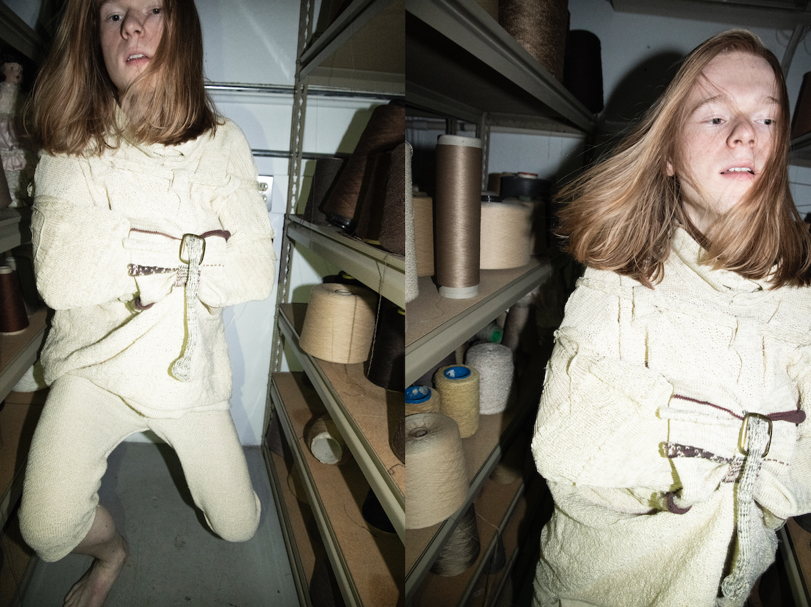
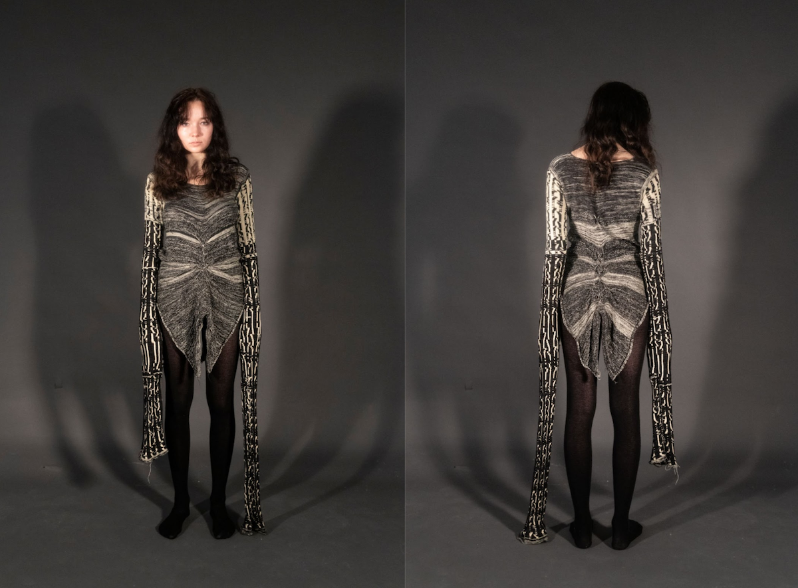
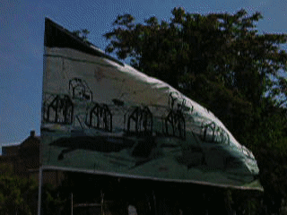
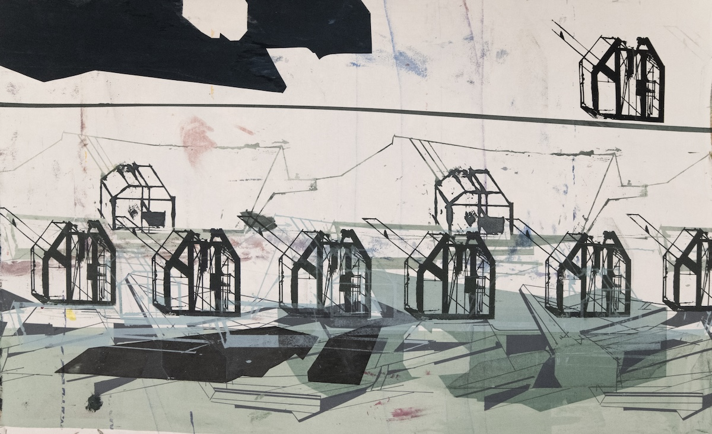
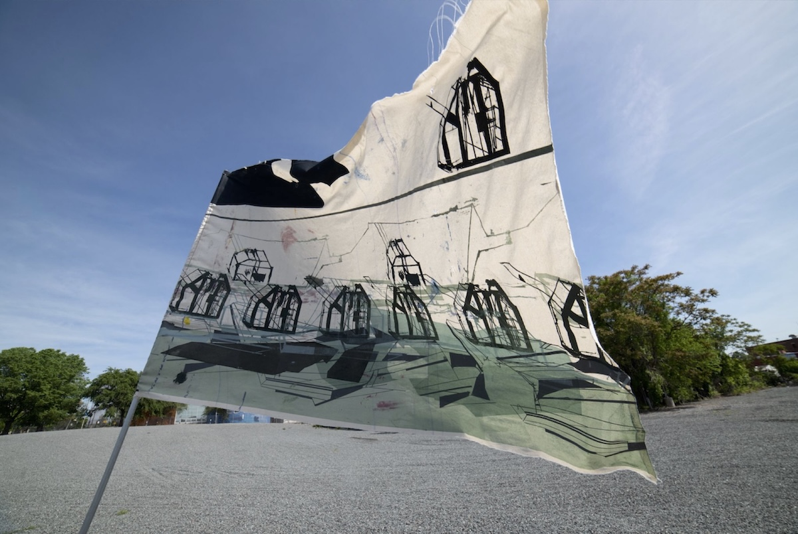

> The overarching theme of my spring semester in textiles has focused mainly on the relationship between the organic and the synthetic. In fibers and dying and machine knitting techniques I focus on this relationship in terms of sound, synthesizing sound to recreate something organic and translating synthesized sounds into textiles. In fabric silkscreen u focus more on this relationship in an architectural sense, creating synthetic environments in a more maximal sense based off of an abstraction of a minimal structure, the minimal structure acting as the organic source. Trough abstraction and synthesis I am able to experiment with different ways of translating my interest in sound and architecture, particularly the abstracted or synthetic aspects of both, into textiles and vice versa. 

Strait Jacket and Pants 

Meduim: Cotton yarn, steel d rings, recycled belt buckles. 
Class: Machine Knitting (Wintersession) 
Risd EFS, 2020 
Modeled by Martin Baggarly 

Knitted Top

*I explore the generative and textural elements of sound design with the serge modular synth and translate those elements into pattern using various machine knitting techniques.*

Meduim: Cotton and wool blend 
Class: Machine Knitting Techniques, Spring 
Risd Textiles, May 2021 
Modeled by Nicole Strubinski 

Bunker Flag

Meduim: Cotton  
Class: Frabric Silkscreening, Spring 
Risd Textiles, May 2021 

*I want to be able to think architecturally when I compose my sound work, as well as design spaces for and around sound and acoustics. Textiles has helped me think fabric as a surface or tool to create structure in some ways but does not overlap with the ideas I’m passionate about exploring visually and conceptually as much as architecture does.*

